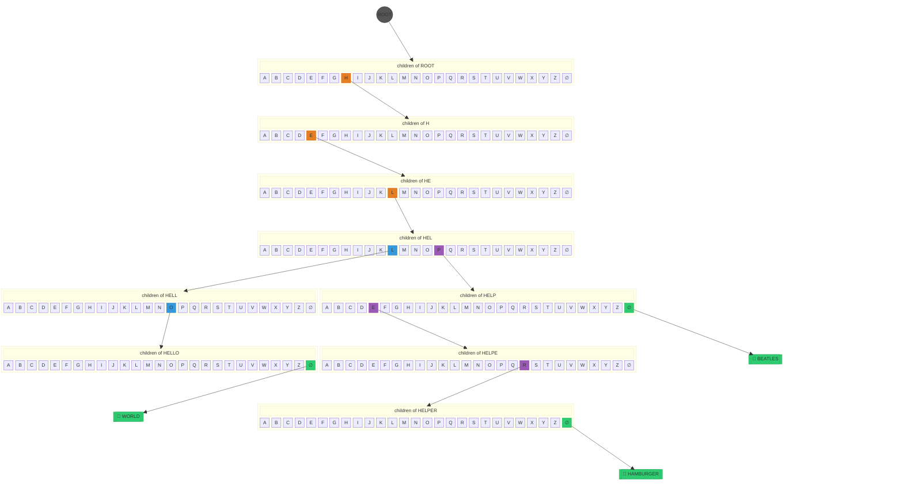
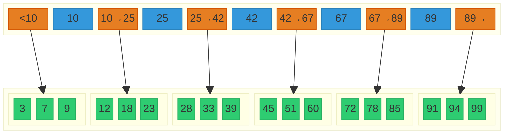

# KTRIE: A Trie/B-Tree Hybrid for Ordered Associative Containers

## Paper Outline

### Abstract

We present the KTRIE, a hybrid of a trie and a B-tree. Each key is decomposed into three logical regions: a shared prefix absorbed into a single node, one or more branch levels handled in a trie-like fashion, fanning out only where the data requires, and a suffix region collected into a B-tree-like flat sorted compact leaf.

The KTRIE offers O(L + log C) lookup, insertion, and deletion, where L is the key length in bytes and C is the bounded compact node capacity. Its distinguishing contribution is suffix compression: the KTRIE collects remaining suffixes into flat sorted leaves. Whereas a traditional trie scatters sparse keys across many small deep nodes, suffix compression collapses them into contiguous arrays. This eliminates per-node overhead, improves locality, and enables O(1) amortized per-element ordered iteration. Effective depth falls well below L for non-adversarial data distributions.

We evaluate two concrete instantiations: KNTRIE and KSTRIE. Both employ bitmap-compressed 256-way branch nodes with branchless dispatch, compact sorted leaves, and share a value storage layer specialized by type: packed bits for Booleans, inline embedding for small trivial types (≤ 8 bytes), and heap-indirected owned copies for larger or non-trivial types.

KNTRIE is specialized for fixed-width integer keys (16-, 32-, and 64-bit), providing a bounded depth and narrowing key representation by depth, with leaf size governed by entry count.

KSTRIE is specialized for variable-length string keys, addressing the challenges of unbounded key length and unpredictable depth. KSTRIE extends prefix compression into the suffix leaves themselves via keysuffix sharing, with leaf capacity governed by a compressed suffix byte budget.

Benchmarks demonstrate that across all operations, both KNTRIE and KSTRIE are competitive with `std::unordered_map` while providing full ordering, and consistently outperform `std::map`. By exploiting prefix compression and suffix truncation, KNTRIE and KSTRIE typically occupy a third or less of the space of `std::map` and `std::unordered_map`. Some benchmark distributions show KNTRIE occupying less space than the raw key-value data alone.

The primary contribution is the prefix/branch/suffix decomposition as a unified hybrid design, with the novel integration of keysuffix sharing.

**Keywords:** trie, B-tree, ordered associative container, prefix/suffix decomposition, keysuffix sharing, cache locality, bitmap indexing, branchless search, variable-length keys

### 1 Introduction

The ordered associative container is a fundamental abstraction in systems programming. Applications from databases to compilers require a data structure that maps keys to values, supports efficient point lookup, and provides sorted traversal over the key space. The C++ standard library offers two options. `std::map`, a red-black tree, provides O(log N) lookup with full key ordering but pays for it with scattered heap allocations, poor cache locality, and 64 bytes of per-node overhead. `std::unordered_map`, a hash table, achieves O(1) expected-case lookup but sacrifices key ordering entirely — sorted iteration requires an O(N log N) post-sort, and range queries and prefix searches are impossible.

This trade-off between ordering and performance has motivated a long line of research into structures that provide both. Tries offer lookup independent of collection size — O(L) where L is the key length — but traditional tries are notoriously wasteful: a 256-way trie node allocates space for 256 children whether one child exists or 200 do. B-trees achieve cache-friendly density by packing many keys into wide sorted nodes, but their O(log N) depth scales with collection size and each comparison examines the full key.

**Figure 1: Standard trie** storing the string keys HELLO, HELP, and HELPER. Nine nodes, each with 27 slots (A–Z plus end-of-string). Of 243 total slots, 12 are occupied — 95% are empty.



**Figure 2: Digital trie** storing four 32-bit integer keys (0x00000000, 0x00000004, 0x000401BC, 0xFEEDFACE). Nine nodes, each with 256 slots. Of 2,304 total slots, 12 are occupied — 99.5% empty.

```mermaid
block
  columns 5

 %% ── Level 0: root pointer ──────────────────────────────────
  space
  space
  ROOT(("ROOT"))
  space
  space

%% ── Level 0: root ───────────────────────────────────────────
  space
  space
  block:L0
    columns 7
    space
    block:l0_title("byte 0 — 256 slots"):5
      space
    end
    space
    l0_00["00"] l0_01["01"] l0_02["02"] l0_g0["···"] l0_FD["FD"] l0_FE["FE"] l0_FF["FF"]
  end
  space
  space

%% ── Level 1: two children ───────────────────────────────────
    space

    block:L1_00
      columns 7
      space
      block:l1a_title("byte 1 — via 00"):5
        space
      end
      space
      l1a_00["00"] l1a_01["01"] l1a_02["02"] l1a_03["03"] l1a_04["04"] l1a_g0["···"] l1a_FF["FF"]
    end

    space

    block:L1_FE
      columns 7
      space
      block:l1b_title("byte 1 — via FE"):5
        space
      end
      space
      l1b_00["00"] l1b_g0["···"] l1b_EC["EC"] l1b_ED["ED"] l1b_EE["EE"] l1b_g1["···"] l1b_FF["FF"]
    end

    space

%% ── Level 2: three children ─────────────────────────────────

    block:L2_00_00
      columns 5
      space
      block:l2a_title("byte 2 — via 00·00"):3
        space
      end
      space
      l2a_00["00"] l2a_01["01"] l2a_02["02"] l2a_g0["···"] l2a_FF["FF"]
    end

    space

    block:L2_00_04
      columns 5
      space
      block:l2b_title("byte 2 — via 00·04"):3
        space
      end
      space
      l2b_00["00"] l2b_01["01"] l2b_02["02"] l2b_g0["···"] l2b_FF["FF"]
    end

    space

    block:L2_FE_ED
      columns 7
      space
      block:l2c_title("byte 2 — via FE·ED"):5
        space
      end
      space
      l2c_00["00"] l2c_g0["···"] l2c_F9["F9"] l2c_FA["FA"] l2c_FB["FB"] l2c_g1["···"] l2c_FF["FF"]
    end

%% ── Level 3: three leaves ───────────────────────────────────

    block:L3_00_00_00
      columns 7
      space
      block:l3a_title("byte 3 — via 00·00·00"):5
        space
      end
      space
      l3a_00["00"] l3a_01["01"] l3a_02["02"] l3a_03["03"] l3a_04["04"] l3a_g0["···"] l3a_FF["FF"]
    end

    block:L3_00_04_01
      columns 7
      space
      block:l3b_title("byte 3 — via 00·04·01"):5
        space
      end
      space
      l3b_00["00"] l3b_g0["···"] l3b_BB["BB"] l3b_BC["BC"] l3b_BD["BD"] l3b_g1["···"] l3b_FF["FF"]
    end

    space

    block:L3_FE_ED_FA
      columns 7
      space
      block:l3c_title("byte 3 — via FE·ED·FA"):5
        space
      end
      space
      l3c_00["00"] l3c_g0["···"] l3c_CD["CD"] l3c_CE["CE"] l3c_CF["CF"] l3c_g1["···"] l3c_FF["FF"]
    end

    space

%% ── Values ──────────────────────────────────────────────────
    val0[["0x00000000 → NULL"]]
    val1[["0x00000004 → FOUR"]]
    val2[["0x000401BC → POTITUS"]]
    space
    val3[["0xFEEDFACE → HAMBURGER"]]

%% ── Edges ───────────────────────────────────────────────────
  ROOT --> l0_title
  l0_00 --> l1a_title
  l0_FE --> l1b_title
  l1a_00 --> l2a_title
  l1a_04 --> l2b_title
  l1b_ED --> l2c_title
  l2a_00 --> l3a_title
  l2b_01 --> l3b_title
  l2c_FA --> l3c_title
  l3a_00 --> val0
  l3a_04 --> val1
  l3b_BC --> val2
  l3c_CE --> val3

%% ── Styles ──────────────────────────────────────────────────
  style l0_00 fill:#e67e22,color:#fff,stroke:#d35400
  style l0_FE fill:#e67e22,color:#fff,stroke:#d35400
  style l1a_00 fill:#e67e22,color:#fff,stroke:#d35400
  style l1a_04 fill:#e67e22,color:#fff,stroke:#d35400
  style l1b_ED fill:#e67e22,color:#fff,stroke:#d35400
  style l2a_00 fill:#e67e22,color:#fff,stroke:#d35400
  style l2b_01 fill:#e67e22,color:#fff,stroke:#d35400
  style l2c_FA fill:#e67e22,color:#fff,stroke:#d35400
  style l3a_00 fill:#e67e22,color:#fff,stroke:#d35400
  style l3a_04 fill:#e67e22,color:#fff,stroke:#d35400
  style l3b_BC fill:#e67e22,color:#fff,stroke:#d35400
  style l3c_CE fill:#e67e22,color:#fff,stroke:#d35400
  style l0_01 fill:#ccc,color:#666,stroke:#aaa
  style l0_02 fill:#ccc,color:#666,stroke:#aaa
  style l0_FD fill:#ccc,color:#666,stroke:#aaa
  style l0_FF fill:#ccc,color:#666,stroke:#aaa
  style l1a_01 fill:#ccc,color:#666,stroke:#aaa
  style l1a_02 fill:#ccc,color:#666,stroke:#aaa
  style l1a_03 fill:#ccc,color:#666,stroke:#aaa
  style l1a_FF fill:#ccc,color:#666,stroke:#aaa
  style l1b_00 fill:#ccc,color:#666,stroke:#aaa
  style l1b_EC fill:#ccc,color:#666,stroke:#aaa
  style l1b_EE fill:#ccc,color:#666,stroke:#aaa
  style l1b_FF fill:#ccc,color:#666,stroke:#aaa
  style l2a_01 fill:#ccc,color:#666,stroke:#aaa
  style l2a_02 fill:#ccc,color:#666,stroke:#aaa
  style l2a_FF fill:#ccc,color:#666,stroke:#aaa
  style l2b_00 fill:#ccc,color:#666,stroke:#aaa
  style l2b_02 fill:#ccc,color:#666,stroke:#aaa
  style l2b_FF fill:#ccc,color:#666,stroke:#aaa
  style l2c_00 fill:#ccc,color:#666,stroke:#aaa
  style l2c_F9 fill:#ccc,color:#666,stroke:#aaa
  style l2c_FB fill:#ccc,color:#666,stroke:#aaa
  style l2c_FF fill:#ccc,color:#666,stroke:#aaa
  style l3a_01 fill:#ccc,color:#666,stroke:#aaa
  style l3a_02 fill:#ccc,color:#666,stroke:#aaa
  style l3a_03 fill:#ccc,color:#666,stroke:#aaa
  style l3a_FF fill:#ccc,color:#666,stroke:#aaa
  style l3b_00 fill:#ccc,color:#666,stroke:#aaa
  style l3b_BB fill:#ccc,color:#666,stroke:#aaa
  style l3b_BD fill:#ccc,color:#666,stroke:#aaa
  style l3b_FF fill:#ccc,color:#666,stroke:#aaa
  style l3c_00 fill:#ccc,color:#666,stroke:#aaa
  style l3c_CD fill:#ccc,color:#666,stroke:#aaa
  style l3c_CF fill:#ccc,color:#666,stroke:#aaa
  style l3c_FF fill:#ccc,color:#666,stroke:#aaa
  style l0_g0 fill:none,color:#999,stroke:none
  style l1a_g0 fill:none,color:#999,stroke:none
  style l1b_g0 fill:none,color:#999,stroke:none
  style l1b_g1 fill:none,color:#999,stroke:none
  style l2a_g0 fill:none,color:#999,stroke:none
  style l2b_g0 fill:none,color:#999,stroke:none
  style l2c_g0 fill:none,color:#999,stroke:none
  style l2c_g1 fill:none,color:#999,stroke:none
  style l3a_g0 fill:none,color:#999,stroke:none
  style l3b_g0 fill:none,color:#999,stroke:none
  style l3b_g1 fill:none,color:#999,stroke:none
  style l3c_g0 fill:none,color:#999,stroke:none
  style l3c_g1 fill:none,color:#999,stroke:none
  style val0 fill:#2ecc71,color:#fff,stroke:#27ae60
  style val1 fill:#2ecc71,color:#fff,stroke:#27ae60
  style val2 fill:#2ecc71,color:#fff,stroke:#27ae60
  style val3 fill:#2ecc71,color:#fff,stroke:#27ae60
  style ROOT fill:#555,color:#fff,stroke:#333
```



The waste in these figures is not an implementation deficiency; it is inherent to the trie's structure. Every level allocates for the full fan-out width, even when only a handful of children exist. For integer keys at byte granularity, the problem is extreme: 256 slots per node, most of them empty, each consuming a pointer's worth of memory.

The B-tree addresses density from the opposite direction. Instead of one key per node with two children, a B-tree node holds many keys in a contiguous sorted array and fans out to many children. A node with 100 keys can be searched with binary search, touching one or two cache lines, while the same 100 keys in a binary search tree require ~7 pointer-chasing hops across 7 random cache lines.

**Figure 3: B-tree node** — sorted keys (blue) in a contiguous array with child pointers (orange) interleaved between them. Each child (green) holds keys within the range defined by its parent's bounding keys. Binary search over the sorted keys touches 1–2 cache lines. This is the density property that KTRIE compact nodes inherit.



The KTRIE combines these two inheritances. Each key is decomposed into three logical regions — a shared PREFIX absorbed into a single comparison, one or more BRANCH levels that fan out via bitmap-compressed dispatch, and a SUFFIX region collected into a B-tree-style flat sorted compact node. Branch nodes replace the sparse trie nodes: a bitmap records which of the 256 possible children exist, and child pointers are packed into a dense array indexed by popcount. Compact nodes replace the deep leaf chains: rather than branching all the way to individual entries, the KTRIE collects remaining suffixes into contiguous sorted arrays and searches them with binary search. The boundaries between prefix, branch, and suffix adapt dynamically to the data — dense key ranges branch deeply, sparse ranges are absorbed into a single compact node.

[Figure: The same key sets from the trie and digital trie figures above, now stored in a KTRIE. Branch nodes contain only the children that exist (bitmap-compressed). Compact nodes hold sorted suffix arrays. Visual contrast: the 9 × 27 or 9 × 256 sparse nodes collapse to 2–3 branch nodes plus compact nodes holding all entries.]

The result is an ordered associative container that approaches hash-table lookup speed while providing full key ordering, range queries, and prefix operations, with a memory footprint that can fall below the raw key-value data size through prefix and suffix compression.

This paper makes the following contributions:

1. The prefix/branch/suffix decomposition as a unified design pattern for ordered associative containers, combining trie-style routing with B-tree-style storage.

2. Bitmap-compressed 256-way branch nodes with branchless dispatch. The find path uses no data-dependent branches at the bitmap level — a miss resolves through the same code path as a hit, with only the data differing.

3. Compact sorted nodes with suffix absorption. Wide sorted arrays serve as the terminal storage, searched via branchless adaptive binary search, with threshold-based promotion to branch nodes and demotion back to compact nodes.

4. Keysuffix sharing, a novel technique in the KSTRIE instantiation. Variable-length key suffixes that share common tails reference the same storage in the compact node's keysuffix region, reducing the effective byte cost per entry.

5. Type-specialized value storage with three categories — packed bits for Booleans, inline embedding for small trivial types, and heap-indirected owned copies for non-trivial types — dispatched entirely at compile time with zero runtime overhead.

We evaluate these contributions through two concrete instantiations. KNTRIE handles fixed-width integer keys (16-, 32-, and 64-bit) with bounded depth and depth-narrowed suffix types. KSTRIE handles variable-length string keys with unbounded depth, character map support, and keysuffix sharing. Benchmarks demonstrate that both are competitive with `std::unordered_map` on lookup speed while providing full ordering, consistently outperform `std::map`, and typically occupy a third or less of the memory of either standard container.

The remainder of the paper is organized as follows. §2 surveys related work and positions the KTRIE relative to existing structures. §3 presents the design in detail: key decomposition, branch nodes with bitmap operations, compact nodes with search algorithms, and skip prefix compression, with both KNTRIE and KSTRIE implementations described for each component. §4 covers shared implementation choices (value storage, sentinel design, memory hysteresis). §5 describes instantiation-specific details. §6 formalizes the operations with complexity analysis. §7 presents experimental evaluation. §8 discusses trade-offs and limitations. §9 concludes.

### 2 Background and Related Work

The KTRIE draws on a long history of tree-structured indexing. This section surveys the foundational data structures and the most relevant modern variants, then positions the KTRIE relative to each along five comparison axes: point lookup, ordered iteration, prefix queries, memory efficiency, and write performance.

**Tries.** The trie, introduced by Fredkin [1960] and analyzed extensively by Knuth [1973, 1998], is a tree in which each node represents a portion of a key rather than the whole key. The path from root to leaf spells out the complete key. Lookup time is O(L), independent of the number of entries N — a fundamental advantage over comparison-based trees. The cost is structural waste: each node allocates for the full fan-out width. A 26-way alphabetic trie wastes most of its child slots at every level; a 256-way byte trie wastes even more. This waste motivated all subsequent work on trie compression.

**Patricia trie.** Morrison [1968] introduced the Patricia trie (Practical Algorithm To Retrieve Information Coded In Alphanumeric), which eliminates single-child nodes by storing a "skip" count at each node indicating how many bits to skip before the next branch point. This prefix compression is the direct ancestor of the KTRIE's skip prefix mechanism (§3.4). The Patricia trie handles arbitrary-length keys but stores only one entry per leaf, forgoing the wide-node density that the KTRIE achieves through compact nodes.

**B-trees.** The B-tree, introduced by Bayer and McCreight [1972], addresses the cost of pointer chasing by packing many keys into each node. A B-tree node contains a sorted array of keys and fans out to a corresponding set of children. The sorted array can be searched with binary search within a single cache-line fetch, dramatically improving locality compared to binary search trees. B-tree depth is O(log_M N), where M is the node fan-out — much shallower than a binary tree's O(log_2 N). The KTRIE's compact nodes inherit the B-tree's wide-node design: a compact node is essentially a B-tree leaf (sorted keys, contiguous layout, binary search) that serves as the terminal storage for a trie subtree.

**Judy arrays.** Baskins [2004] developed the Judy array, a high-performance associative array using bitmap-indexed compression at each trie level. Judy arrays use a 256-bit bitmap to record which children are present, then store child pointers in a dense array indexed by the bitmap's popcount. The KTRIE's branch node design borrows this technique directly. Where Judy arrays use multiple specialized node types (linear, bitmap, uncompressed) based on population density, the KTRIE uses a single bitmap-compressed node type for all branch levels and delegates density adaptation to the compact-node/branch-node threshold.

**Adaptive Radix Tree (ART).** Leis et al. [2013] introduced ART, which adapts its node size to the actual fan-out at each level using four node types: Node4 (linear scan), Node16 (SIMD comparison), Node48 (256-byte index array), and Node256 (direct indexing). ART's key insight is that different levels of a trie have different population densities, and the node representation should match. ART also introduced path compression (collapsing single-child chains), analogous to the Patricia trie's skip counts and the KTRIE's skip prefix.

ART achieves excellent point lookup performance through its per-level node adaptation, and well-studied concurrent variants (ART-OLC, ART-ROWEX) extend it to multi-threaded workloads. However, ART creates a separate node for every divergent byte of the key — there is no leaf compression analogous to the KTRIE's compact nodes. For keys with long shared prefixes that diverge in the last few bytes, ART traverses many single-entry nodes where the KTRIE would absorb the entire suffix into one compact node. ART also does not compress shared suffixes; each path through the trie stores its key material independently.

**HAT-trie.** The burst trie, introduced by Heinz, Zobel, and Williams [2002], and its refinement the HAT-trie by Askitis and Sinha [2007], combines trie routing at upper levels with hash-based containers at the leaves. When a leaf's hash container exceeds a threshold, it "bursts" into trie nodes. This produces good average-case point lookup (O(1) per leaf via hashing) and moderate memory efficiency for string keys.

The HAT-trie's leaves are unordered. Iterating in sorted order requires sorting leaf contents on the fly or maintaining a separate sorted index. Prefix queries require visiting every hash entry below the prefix point. The KTRIE's compact nodes are always sorted, providing ordered iteration and prefix queries without auxiliary structures. The trade-off is write performance: HAT-trie's hash containers have amortized O(1) insert, while the KTRIE's sorted compact nodes require O(C) memmove to maintain order.

**Branchless binary search.** Khuong and Morin [2017] analyzed the performance of binary search variants on modern hardware. The key finding is that replacing data-dependent branches with conditional moves (cmov) eliminates branch misprediction penalties, which dominate the cost of binary search on arrays larger than a few cache lines. The KTRIE's compact node search uses a branchless variant of this technique, extended with an adaptive initial step that handles non-power-of-two entry counts without padding.

**Boolean bit-packing.** The `std::vector<bool>` specialization, dating to the original STL design by Stepanov and Lee [1994] and standardized with commentary by Austern [1998], packs boolean values one bit per entry rather than one byte. The KTRIE's value storage adopts this technique for `VALUE = bool`, packing values into `uint64_t` words. In the KNTRIE's Bitmap256 leaf, both keys and values are stored as bitmaps, achieving the tightest possible representation for boolean-valued sets.

**Comparison axes.** The following table summarizes how the KTRIE relates to each structure along the key comparison axes.

*Point lookup.* Hash tables achieve O(1) expected case. ART and standard tries are O(L). Comparison-based trees (std::map, B-trees) are O(L log N) for string keys or O(log N) for integer keys. The KTRIE is O(L + log C), where the log C term comes from the binary search within compact nodes and C is bounded by the split threshold.

*Ordered iteration.* Red-black trees, B-trees, and the KTRIE provide sorted iteration natively with O(1) amortized advance. Hash tables and HAT-trie leaves do not — sorted access requires an O(N log N) sort.

*Prefix queries.* The KTRIE and ART support structural prefix descent: navigate to the prefix point in the trie, then collect the subtree below. The KTRIE additionally supports prefix_split (O(1) subtree steal at branch boundaries) and prefix_copy (structural clone). HAT-trie can descend to the prefix point but must then scan unordered hash containers. Hash tables cannot perform prefix queries at all.

*Memory.* The KTRIE compresses shared prefixes (via skip) and shared suffixes (via keysuffix sharing in KSTRIE). ART compresses prefixes via path compression but stores each key path independently. Hash tables store the full key per entry plus bucket overhead. `std::map` adds ~64 bytes of per-node structural overhead. KTRIE benchmarks show 12–18 bytes per entry for `uint64_t` keys with `int32_t` values, compared to 48–64 for `std::unordered_map` and 64 for `std::map`.

*Write performance.* Hash tables and HAT-trie achieve amortized O(1) insert. The KTRIE's insert is O(L + log C) amortized, with O(L + C) worst case when a compact node overflows and splits. The memmove cost within compact nodes (O(C) to open or close a gap) is the primary write-path expense. The KTRIE is optimized for read-heavy workloads where the compact sorted layout pays back on every subsequent lookup and iteration.

*Concurrency.* ART has well-studied concurrent variants (ART-OLC, ART-ROWEX). The KTRIE currently requires external synchronization for concurrent writes; concurrent reads are safe.

The KTRIE is not trying to beat hash tables on unordered point lookups. Its positioning is: ordered access with trie-speed lookup and B-tree-density storage, at a fraction of the memory cost of the standard ordered and unordered containers. The more the keys share common structure — URLs, file paths, hierarchical identifiers — the more the compression pays off.

### 3 Design

The KTRIE is a design pattern for ordered associative containers, not a single data structure. It decomposes every key into three logical regions — PREFIX, BRANCH, and SUFFIX — with boundaries that adapt dynamically to the data in each subtree. A dense key range may require deep branching; a sparse range may be absorbed entirely into a single flat node. The structure reshapes itself around the data it holds.

The pattern is built from four core components. Branch nodes provide sparse fan-out via bitmap-compressed dispatch, routing lookups one byte at a time through only the children that exist. Compact nodes are B-tree-style flat sorted arrays that collect entries whose remaining key material (the suffix) fits within a threshold. Skip prefix compression collapses runs of shared bytes into a single comparison, eliminating entire levels of dispatch. Dynamic promotion and demotion governs the transition between compact nodes and branch nodes: as entries accumulate, a compact node overflows and splits into a branch node with compact children; as entries are removed, a branch subtree coalesces back into a single compact node.

In the general KTRIE pattern, branch nodes could hold entries directly (mixed nodes in the B-tree sense), and compact nodes could have children (serving as internal nodes). The two concrete instantiations presented here simplify this: branch nodes are pure routing, and compact nodes are pure leaves. This separation is possible because branch nodes' byte-level dispatch already provides the fan-out that B-tree internal nodes provide — compact nodes do not need children because the branching structure above them handles navigation. Two exceptions exist: in KNTRIE, when the remaining suffix narrows to a single byte, a bitmap-based leaf (Bitmap256) replaces the sorted array, effectively making the branch node a leaf. In KSTRIE, keys that terminate at a branch point (where one key is a prefix of another) are stored via an end-of-string (EOS) child slot on the branch node itself.

We evaluate two instantiations of the KTRIE pattern. KNTRIE handles fixed-width integer keys (16-, 32-, and 64-bit), providing a bounded maximum depth and the ability to narrow the suffix representation by depth. KSTRIE handles variable-length string keys, addressing the challenges of unbounded key length, unpredictable depth, and keys that are prefixes of other keys.

For each component below, we present the KTRIE concept, then describe how KNTRIE and KSTRIE each implement it.

#### 3.1 Key Decomposition

Every key entering a KTRIE is logically partitioned into three regions:

```
KEY = [PREFIX] [BRANCH ...] [SUFFIX]
```

The PREFIX is a run of key bytes shared by all entries in a subtree. Rather than creating a chain of single-child nodes to traverse this common prefix — as a naive trie would — the KTRIE captures the entire shared prefix in a single node and verifies it in one comparison. This eliminates the wasted memory and latency of redundant intermediate levels. When a lookup reaches a prefix-captured node, it compares the full prefix in one step and either continues or exits immediately.

The BRANCH region consists of one or more levels of trie-style fan-out. Each level consumes one byte of the key and dispatches to one of up to 256 children. Branch nodes exist only where the data actually fans out; prefix capture absorbs the levels where it does not. The number of branch levels depends on the data distribution: a dataset where all keys share the first four bytes and diverge on the fifth may have four prefix bytes and a single branch level, while a dataset with immediate divergence may have no prefix and several branch levels.

The SUFFIX is the remaining portion of the key after all branch levels have been consumed. Rather than continuing to subdivide into deeper branch nodes, the KTRIE collects entries with different suffixes into a compact node: a flat sorted array of suffix/value pairs stored in a single contiguous allocation. This is the B-tree inheritance — wide sorted nodes that trade further tree subdivision for cache-friendly sequential storage. A compact node holding hundreds of entries in a contiguous sorted array is far more cache-friendly and memory-efficient than the same entries scattered across a tree of branch nodes.

The boundaries between PREFIX, BRANCH, and SUFFIX are not fixed at compile time. They are determined per-subtree by the data. A subtree where 1000 keys share the same top four bytes uses one prefix node instead of four branch levels. A subtree small enough to fit in a single compact node skips branching entirely. As entries are added or removed, the structure adapts: compact nodes overflow and split into branch subtrees, and branch subtrees coalesce back into compact nodes when the entry count drops.

**KNTRIE key representation.** All key types — `uint16_t`, `int32_t`, `uint64_t`, signed or unsigned — are transformed into a canonical 64-bit internal representation before any operation. Signed integers require a sign-bit flip (`key ^= 1ULL << (key_bits - 1)`) to convert two's complement ordering to unsigned ordering, mapping `INT_MIN → 0` and `INT_MAX → 0xFFFFFFFF`. The key is then left-aligned so its most significant bit sits at bit 63 of a `uint64_t`. A 16-bit key `0xABCD` becomes `0xABCD000000000000`; a 32-bit key `0x12345678` becomes `0x1234567800000000`. This left-alignment makes byte extraction uniform: the dispatch byte at any depth is always at the same bit position, regardless of whether the original key was 16, 32, or 64 bits wide. Shorter keys have fewer meaningful bytes before they bottom out.

As the lookup descends through branch levels, each level consumes one byte, and the suffix type narrows: a `uint64_t` key at depth 4 has consumed four bytes, leaving a 32-bit suffix that can be stored as a `uint32_t` rather than a full `uint64_t`. This narrowing halves the per-entry key storage in compact nodes at every two-byte depth increment. The key width is a compile-time constant, so the maximum depth is bounded: 2 levels for `uint16_t`, 4 for `uint32_t`, 8 for `uint64_t`.

**KSTRIE key representation.** String keys are raw byte sequences. Each byte is passed through a character map — a compile-time constant `std::array<uint8_t, 256>` — before dispatch or storage. The default identity map preserves raw byte ordering. A case-insensitive map (e.g., `upper_char_map`) maps both `'a'` and `'A'` to the same value, making lookups case-insensitive. The map is a template parameter, resolved entirely at compile time with no runtime dispatch cost.

Variable-length keys introduce a structural concern absent from fixed-width keys: a key can be a proper prefix of another key. The string `"HELP"` is a valid key that is also a prefix of `"HELPER"`. This requires an end-of-string (EOS) mechanism at branch nodes, described in §3.2.

#### 3.2 Branch Nodes

A branch node implements 256-way fan-out dispatching on one byte of the key. In a naive trie, each node allocates space for all 256 possible children, whether they exist or not. A KTRIE branch node uses a bitmap to record which children are present and stores child pointers in a dense array indexed by the bitmap's rank operation. A node with three children allocates space for three child pointers, not 256.

##### 3.2.1 Bitmap Operations

The bitmap is the core mechanism that compresses 256 possible children down to only the children that exist. For a 256-way branch, the bitmap is four `uint64_t` words (256 bits). All operations below compile to branchless instruction sequences on modern x86 — shifts, popcount, and bitwise masks with no data-dependent branches.

**Presence test (has_bit).** To test whether child byte `idx` exists, shift the appropriate word right by `idx mod 64` and test bit 0. This is a single instruction.

**Rank (count_below).** To determine the position of child `idx` in the dense array, count how many set bits precede it. Build a mask of all bits below `idx` within its word: `(1ULL << (idx & 63)) - 1`. AND the mask with the bitmap word and popcount the result. For a multi-word bitmap, add the popcounts of all complete words below the target word. The cross-word accumulation is itself branchless: each prior word's popcount is masked by `& -int(w > N)`, which evaluates to all-ones (pass through) when the word index is below the target, and zero (mask out) otherwise. No conditional branch at any step. [Figure]

**Dispatch (find_slot).** The full dispatch operation combines presence testing and rank computation into a single branchless sequence. The target bit is shifted to the sign position via a left shift. The popcount of the shifted word gives a 1-based rank if the bit is set, or an arbitrary value if not. The result is masked to zero on miss: `slot &= -int(found)`, where `found` is the sign bit after the shift. A miss produces slot index 0, which holds the sentinel (§4.2). A hit produces a positive index into the dense child array. [Figure]

**Unfiltered rank (slot_for_insert).** Returns the count of set bits strictly before position `idx`, without testing whether `idx` itself is set. This gives the correct insertion point when adding a new child. Used only on the insert path.

**Scanning (find_next_set, find_prev_set).** To find the next occupied child after a given byte, mask off bits below the starting position and find the lowest set bit in the result via `countr_zero`. If the current word is exhausted, advance to the next word. The reverse operation masks off bits above the starting position and finds the highest set bit via `63 - countl_zero`. These scans drive iterator advancement: when a leaf is exhausted, the iterator walks to the parent branch node and scans the bitmap for the next (or previous) sibling. [Figure]

**Mutation (set_bit, clear_bit).** Setting a bit uses OR; clearing uses AND-NOT. These maintain the bitmap as children are added or removed by the insert and erase paths.

##### 3.2.2 Dispatch Modes

The bitmap operations combine into three named dispatch modes, selected at compile time based on the calling operation.

BRANCHLESS mode is used on the find path — the hot path. It does not check the presence bit with a branch. The target bit is shifted to the sign position, the popcount gives a 1-based rank, and the result is masked to zero on miss. A miss produces slot 0, which holds the sentinel. The find loop follows the sentinel pointer and detects the miss downstream. No conditional branch exists at the bitmap level. This matters because the find path executes millions of times per second, and a data-dependent branch at every level would stall the pipeline on unpredictable key patterns.

FAST_EXIT mode is used by insert, erase, and iteration. It checks the presence bit first. If the child is absent, it returns -1 immediately. If present, the popcount minus 1 gives the 0-based index. The branch is acceptable here because the insert path typically expects the child to be absent (creating a new entry), and the erase path expects it to be present (removing an existing entry). The branch predictor handles these well.

UNFILTERED mode is used only when computing the insertion position for a new child. It returns the rank unconditionally, without checking presence. This gives the correct position in the dense array where the new child pointer should be inserted.

##### 3.2.3 Tagged Pointers (KNTRIE)

KNTRIE encodes the node type in the pointer itself, avoiding a memory access to determine whether a child is a leaf or an internal node. Every child pointer is a `uint64_t` with the following encoding. A leaf pointer has bit 63 (LEAF_BIT) set; the address is recovered by XOR with LEAF_BIT. An internal node pointer has no tag bits, but it targets `node[2]` — two `uint64_t`s past the start of the allocation, past the header and parent pointer, landing directly on the bitmap. This means the find loop can use the pointer as-is for bitmap access without adjusting for the header, saving one addition per descent level. The sentinel is `LEAF_BIT | NOT_FOUND_BIT` (bits 63 and 62), a pure bit pattern with no backing allocation. User-space pointers on x86-64 never have bits 62–63 set — canonical addresses are below 2^47 on 4-level paging and below 2^56 on 5-level paging — so the tags are unambiguous.

The find loop is a tight `while (!(ptr & LEAF_BIT))` loop. Each iteration tests the sign bit (one instruction), extracts the dispatch byte, performs a branchless bitmap lookup, and follows the child pointer. When the sign bit indicates a leaf, the loop exits. A subsequent `ptr & NOT_FOUND_BIT` test distinguishes a miss (sentinel) from a hit (real leaf) — a single bit test with no pointer dereference.

##### 3.2.4 Node Type Dispatch (KSTRIE)

KSTRIE does not use tagged pointers. The node type is stored in the node's own header via a flags field: bit 0 indicates a bitmask node, bit 2 indicates the presence of a skip prefix. A header with all flags zero is a compact node with no skip. Type dispatch reads the header after following the pointer — one extra memory access compared to KNTRIE's tag-in-pointer scheme. This design avoids the address-space assumptions that tagged pointers require and simplifies the pointer representation: a child pointer is a plain `uint64_t*`.

**Figure 5: KSTRIE bitmask nodes** — the same HELLO/HELP/HELPER keys after the compact node has overflowed and split. Root bitmask dispatches on H, second bitmask has skip "EL" and dispatches on L and P. Two compact leaves hold the remaining suffixes.

```mermaid
block
  columns 1

  ROOT(("ROOT"))

%% ── Bitmask: root ────────────────────────────────────────────
  block:BM0
    columns 6

    space
    block:bm0_title("bitmask node — root • bitmap: {H}"):4
      space
    end
    space

    block:BM0_HDR
      columns 1
      block:bm0h_lbl["hdr"]:1
        space
      end
      bm0_hdr["bitmask cnt=1 skip=0"]
    end

    block:BM0_PAR
      columns 1
      block:bm0p_lbl["parent"]:1
        space
      end
      bm0_par["∅"]
    end

    block:BM0_TT
      columns 1
      block:bm0tt_lbl["total_tail"]:1
        space
      end
      bm0_tt["6"]
    end

    block:BM0_BMP
      columns 1
      block:bm0bm_lbl["bitmap"]:1
        space
      end
      bm0_bmp["H"]
    end

    block:BM0_SLOTS
      columns 2
      block:bm0sl_lbl["sentinel | children"]:2
        space
      end
      bm0_sent["SENTINEL"] bm0_c0["→ child H"]
    end

    block:BM0_EOS
      columns 1
      block:bm0e_lbl["eos"]:1
        space
      end
      bm0_eos["SENTINEL"]
    end

  end

%% ── Bitmask: after H, skip=EL ────────────────────────────────
  block:BM1
    columns 7

    space
    block:bm1_title("bitmask node — after H • skip: E L • bitmap: {L, P}"):5
      space
    end
    space

    block:BM1_HDR
      columns 1
      block:bm1h_lbl["hdr"]:1
        space
      end
      bm1_hdr["bitmask cnt=2 skip=2"]
    end

    block:BM1_PAR
      columns 1
      block:bm1p_lbl["parent"]:1
        space
      end
      bm1_par["↑ root"]
    end

    block:BM1_TT
      columns 1
      block:bm1tt_lbl["total_tail"]:1
        space
      end
      bm1_tt["3"]
    end

    block:BM1_BMP
      columns 1
      block:bm1bm_lbl["bitmap"]:1
        space
      end
      bm1_bmp["L P"]
    end

    block:BM1_SLOTS
      columns 3
      block:bm1sl_lbl["sentinel | children"]:3
        space
      end
      bm1_sent["SENTINEL"] bm1_cL["→ child L"] bm1_cP["→ child P"]
    end

    block:BM1_EOS
      columns 1
      block:bm1e_lbl["eos"]:1
        space
      end
      bm1_eos["SENTINEL"]
    end

    block:BM1_SKIP
      columns 2
      block:bm1sk_lbl["skip"]:2
        space
      end
      bm1_sk0["E"] bm1_sk1["L"]
    end

  end

%% ── Compact leaves side by side ──────────────────────────────
  block:LEAVES
    columns 2

    block:CK_L
      columns 3
      block:ckl_title("compact leaf via L — 1 entry"):3
        space
      end

      block:CKL_L
        columns 1
        block:ckl_l_lbl["L[]"]:1
          space
        end
        ckl_L0["1"]
      end
      block:CKL_F
        columns 1
        block:ckl_f_lbl["F[]"]:1
          space
        end
        ckl_F0["O"]
      end
      block:CKL_V
        columns 1
        block:ckl_v_lbl["value"]:1
          space
        end
        ckl_V0[["WORLD"]]
      end

    end

    block:CK_P
      columns 6
      space
      block:ckp_title("compact leaf via P — 2 entries"):4
        space
      end
      space

      block:CKP_L
        columns 2
        block:ckp_l_lbl["L[]"]:2
          space
        end
        ckp_L0["0"] ckp_L1["2"]
      end
      block:CKP_F
        columns 2
        block:ckp_f_lbl["F[]"]:2
          space
        end
        ckp_F0["∅"] ckp_F1["E"]
      end
      block:CKP_O
        columns 2
        block:ckp_o_lbl["O[]"]:2
          space
        end
        ckp_O0["—"] ckp_O1["0"]
      end
      block:CKP_KS
        columns 1
        block:ckp_ks_lbl["keysuffix"]:1
          space
        end
        ckp_ks0["R"]
      end
      block:CKP_V
        columns 2
        block:ckp_v_lbl["values"]:2
          space
        end
        ckp_V0[["BEATLES"]] ckp_V1[["HAMBURGER"]]
      end
      space

    end
  end

  ROOT --> bm0_title
  bm0_c0 --> bm1_title
  bm1_cL --> ckl_title
  bm1_cP --> ckp_title

  style ROOT fill:#555,color:#fff,stroke:#333
  style bm0_bmp fill:#e67e22,color:#fff,stroke:#d35400
  style bm0_c0 fill:#e67e22,color:#fff,stroke:#d35400
  style bm0_sent fill:#888,color:#fff,stroke:#666
  style bm0_eos fill:#888,color:#fff,stroke:#666
  style bm1_bmp fill:#e67e22,color:#fff,stroke:#d35400
  style bm1_cL fill:#3498db,color:#fff,stroke:#2980b9
  style bm1_cP fill:#9b59b6,color:#fff,stroke:#8e44ad
  style bm1_sent fill:#888,color:#fff,stroke:#666
  style bm1_eos fill:#888,color:#fff,stroke:#666
  style bm1_sk0 fill:#836c12,color:#fff,stroke:#e67e22
  style bm1_sk1 fill:#836c12,color:#fff,stroke:#e67e22
  style ckl_L0 fill:#3498db,color:#fff,stroke:#2980b9
  style ckl_F0 fill:#3498db,color:#fff,stroke:#2980b9
  style ckl_V0 fill:#2ecc71,color:#fff,stroke:#27ae60
  style ckp_L0 fill:#9b59b6,color:#fff,stroke:#8e44ad
  style ckp_L1 fill:#e74c3c,color:#fff,stroke:#c0392b
  style ckp_F0 fill:#9b59b6,color:#fff,stroke:#8e44ad
  style ckp_F1 fill:#e74c3c,color:#fff,stroke:#c0392b
  style ckp_O1 fill:#e74c3c,color:#fff,stroke:#c0392b
  style ckp_ks0 fill:#e74c3c,color:#fff,stroke:#c0392b
  style ckp_V0 fill:#2ecc71,color:#fff,stroke:#27ae60
  style ckp_V1 fill:#2ecc71,color:#fff,stroke:#27ae60
```



**Figure 5b: KSTRIE bitmask reconstruction** — key reconstruction walking dispatch bytes, skip bytes, and leaf suffixes.

```mermaid
block
  columns 7

  block:CS
    columns 1
    block:cs_lbl["key"]:1
      space
    end
    cs0["HELLO"] cs1["HELP"] cs2["HELPER"]
  end

  block:RD
    columns 1
    block:rd_lbl["dispatch"]:1
      space
    end
    rd0["H"] rd1["H"] rd2["H"]
  end

  block:RSKIP
    columns 2
    block:rsk_lbl["skip"]:2
      space
    end
    rs0_0["E"] rs0_1["L"]
    rs1_0["E"] rs1_1["L"]
    rs2_0["E"] rs2_1["L"]
  end

  block:RLD
    columns 1
    block:rld_lbl["dispatch"]:1
      space
    end
    rld0["L"] rld1["P"] rld2["P"]
  end

  block:RLF
    columns 1
    block:rlf_lbl["F"]:1
      space
    end
    rlf0["O"] rlf1["∅"] rlf2["E"]
  end

  block:RLKS
    columns 1
    block:rlks_lbl["keysuffix"]:1
      space
    end
    rlks0["—"] rlks1["—"] rlks2["R"]
  end

  block:ROUT
    columns 6
    block:ro_lbl["= key"]:6
      space
    end
    ro00["H"] ro01["E"] ro02["L"] ro03["L"] ro04["O"] space
    ro10["H"] ro11["E"] ro12["L"] ro13["P"] space:2
    ro20["H"] ro21["E"] ro22["L"] ro23["P"] ro24["E"] ro25["R"]
  end

  style rd0 fill:#e67e22,color:#fff,stroke:#d35400
  style rd1 fill:#e67e22,color:#fff,stroke:#d35400
  style rd2 fill:#e67e22,color:#fff,stroke:#d35400
  style rs0_0 fill:#836c12,color:#fff,stroke:#e67e22
  style rs0_1 fill:#836c12,color:#fff,stroke:#e67e22
  style rs1_0 fill:#836c12,color:#fff,stroke:#e67e22
  style rs1_1 fill:#836c12,color:#fff,stroke:#e67e22
  style rs2_0 fill:#836c12,color:#fff,stroke:#e67e22
  style rs2_1 fill:#836c12,color:#fff,stroke:#e67e22
  style rld0 fill:#3498db,color:#fff,stroke:#2980b9
  style rld1 fill:#9b59b6,color:#fff,stroke:#8e44ad
  style rld2 fill:#e74c3c,color:#fff,stroke:#c0392b
  style rlf0 fill:#3498db,color:#fff,stroke:#2980b9
  style rlf1 fill:#9b59b6,color:#fff,stroke:#8e44ad
  style rlf2 fill:#e74c3c,color:#fff,stroke:#c0392b
  style rlks2 fill:#e74c3c,color:#fff,stroke:#c0392b
```



**KNTRIE branch node layout.** The allocation begins with a 2-u64 header: `node[0]` is the packed 8-byte node header (§5.1), and `node[1]` is the parent pointer for bidirectional iteration. The bitmap follows, then the miss pointer (sentinel) at slot 0, then the dense child array, and finally a descendant count at the end of the allocation. The descendant count holds the exact total entry count for the subtree and drives coalesce decisions on erase. Embed chains for skip prefix compression are described in §3.4.

**KSTRIE branch node layout.** The allocation begins with an 8-byte header, followed by the parent pointer, a `total_tail` field, the bitmap, the sentinel, the dense child array, an EOS child slot, and skip bytes at the end. The EOS child slot handles keys that terminate at this branch point — for example, `"HELP"` exists alongside `"HELPER"`. When a lookup exhausts its key bytes at a branch node, it follows the EOS child rather than dispatching on a byte that does not exist.

The `total_tail` field estimates the byte cost of collapsing the entire subtree back into a single compact node. The estimate accounts for three components per entry in the subtree: the keysuffix bytes stored in compact leaf children, one dispatch byte per entry for the byte consumed at this bitmask level, and, for each nested branch node with skip length S, an additional S bytes per entry passing through it. This total is maintained incrementally — insert propagates the delta upward, erase subtracts it — and the coalesce check is simply `total_tail <= COMPACT_KEYSUFFIX_LIMIT`. This conservative estimate avoids trial collapse: without it, the erase path would need to walk the entire subtree to determine whether it fits in a single compact node, which was a significant performance problem before this heuristic was introduced.

#### 3.3 Compact Nodes

A compact node stores entries in a flat sorted array within a single contiguous allocation. In the general KTRIE pattern, compact nodes could serve as internal nodes — holding sorted entries and child pointers, as in a B-tree. KNTRIE and KSTRIE restrict compact nodes to the leaf position. This simplification is possible because branch nodes' byte-level dispatch already provides navigational fan-out: the path from root to compact node routes the lookup to the correct key range, and the compact node handles the final suffix search. Eliminating child pointers from compact nodes simplifies their layout and avoids the complexity of splitting and merging mixed key/child structures.

Search within a compact node uses binary search. The transition between compact nodes and branch nodes is governed by a threshold: when a compact node's content exceeds the threshold, it splits into a branch node with compact children; when a branch subtree's total content drops below the threshold, it coalesces back into a single compact node.

**Figure 6: KSTRIE compact node** — the same HELLO/HELP/HELPER keys stored in a single compact node (the small-N case). Skip "HEL" captures the shared prefix. Three entries with parallel arrays L[], F[], O[] and a shared keysuffix region.


**Figure 6b: KSTRIE compact node reconstruction** — key reconstruction walking skip bytes, F[], and keysuffix region. O[1] = O[2] = 1 because HELP shares HELPER's offset — L=1 means zero tail bytes are read.

```mermaid
block
  columns 6

  block:CS
    columns 1
    block:cs_lbl["slot"]:1
      space
    end
    cs0["0"] cs1["1"] cs2["2"]
  end

  block:RSKIP
    columns 3
    block:rsk_lbl["skip"]:3
      space
    end
    rs0_0["H"] rs0_1["E"] rs0_2["L"]
    rs1_0["H"] rs1_1["E"] rs1_2["L"]
    rs2_0["H"] rs2_1["E"] rs2_2["L"]
  end

  block:RF
    columns 1
    block:rf_lbl["F"]:1
      space
    end
    rf0["L"] rf1["P"] rf2["P"]
  end

  block:RKS
    columns 2
    block:rks_lbl["keysuffix"]:2
      space
    end
    rk0_0["O"] rk0_1[" "]
    rk1_0["—"] rk1_1["(L=1)"]
    rk2_0["E"] rk2_1["R"]
  end

  block:ROUT
    columns 6
    block:ro_lbl["= key"]:6
      space
    end
    ro00["H"] ro01["E"] ro02["L"] ro03["L"] ro04["O"] space
    ro10["H"] ro11["E"] ro12["L"] ro13["P"] space:2
    ro20["H"] ro21["E"] ro22["L"] ro23["P"] ro024["E"] ro25["R"]
  end

  block:NOTE
    columns 1
    block:notel["NOTES:"]
      space
    end
    note["O[1] = O[2] = 1"]
    note2["HELP shares HELPER's offset"]
    note3["Because L=1 means zero tail bytes read"]
  end

  style rs0_0 fill:#836c12,color:#fff,stroke:#e67e22
  style rs0_1 fill:#836c12,color:#fff,stroke:#e67e22
  style rs0_2 fill:#836c12,color:#fff,stroke:#e67e22
  style rs1_0 fill:#836c12,color:#fff,stroke:#e67e22
  style rs1_1 fill:#836c12,color:#fff,stroke:#e67e22
  style rs1_2 fill:#836c12,color:#fff,stroke:#e67e22
  style rs2_0 fill:#836c12,color:#fff,stroke:#e67e22
  style rs2_1 fill:#836c12,color:#fff,stroke:#e67e22
  style rs2_2 fill:#836c12,color:#fff,stroke:#e67e22
  style rf0 fill:#3498db,color:#fff,stroke:#2980b9
  style rf1 fill:#9b59b6,color:#fff,stroke:#8e44ad
  style rf2 fill:#e74c3c,color:#fff,stroke:#c0392b
  style rk0_0 fill:#3498db,color:#fff,stroke:#2980b9
  style rk1_0 fill:#9b59b6,color:#fff,stroke:#8e44ad
  style rk2_0 fill:#e74c3c,color:#fff,stroke:#c0392b
  style rk2_1 fill:#e74c3c,color:#fff,stroke:#c0392b
```



[Figure: KNTRIE compact node layout (sorted keys + values). Same integer key sets from §1 shown as they would be stored when the entire dataset fits in a single compact node.]

**KNTRIE compact nodes.** Each entry is a suffix/value pair. The suffix type narrows with depth: at depth 4 in a `uint64_t` key, the suffix is a `uint32_t`; at depth 6, it is a `uint16_t`. The suffixes are stored in a sorted array, and the values occupy a parallel array at a computed offset. Lookup uses a branchless adaptive binary search.

The search handles arbitrary entry counts without requiring power-of-two padding. The algorithm computes `bit_width((count - 1) | 1u)` to find the largest power of two strictly less than `count`. The difference between `count` and that power of two determines a "diff" offset. A single branchless comparison at `base + diff` either advances the base pointer or leaves it unchanged, reducing the remaining search space to an exact power of two. The main loop then executes a standard branchless binary search, halving the count at each step via a conditional move. The diff step's comparison (`*diff_val <= key`) mirrors the loop body's comparison exactly, producing uniform codegen. The `| 1u` in the bit_width argument handles the count=1 edge case branchlessly — it folds into the `lzcnt` dependency chain with zero additional cost on x86. For exact powers of two (4, 8, 16, ...), the diff step performs one iteration's worth of meaningful work, saving one loop iteration.

[Figure: adaptive search walkthrough with 20 entries. bit_width(19) = 5, count2 = 16, diff = 4. Case A: key < keys[4], search [0..15]. Case B: key ≥ keys[4], search [4..19]. Four loop iterations narrow to the final position.]

A variant `find_base_first` uses strict `<` instead of `<=` to find the first occurrence of a key (lower bound), used by iterator operations.

The compact node capacity is governed by COMPACT_MAX = 4096. This value is chosen by a fan-out argument: when a compact node overflows and splits into a branch node, its entries are distributed across up to 256 children. At 4096 entries, the average child receives 4096 / 256 ≈ 16 entries, ensuring that even the smallest post-split children are viable nodes with enough entries to amortize their header overhead. A lower threshold would create more branch levels and more pointer chasing; a higher threshold would enlarge the binary search at each leaf. On erase, when a branch subtree's descendant count drops to COMPACT_MAX or below, the entire subtree is collected into a single compact node and the branch structure is deallocated.

When the remaining suffix narrows to a single byte (the suffix type is `uint8_t`), a specialized Bitmap256 node replaces the sorted array. Since all 256 possible suffix values can be represented in a 256-bit bitmap, the key array is eliminated entirely — the bitmap *is* the key storage. Lookup reduces to a single bit test plus a popcount for the value slot index. For `VALUE = bool`, the values are stored as a second 256-bit bitmap, giving the tightest possible representation: 14 `uint64_t`s for up to 256 boolean key/value pairs.

**KSTRIE compact nodes.** Each entry's suffix is a variable-length byte sequence, stored across three parallel arrays and a shared keysuffix region. The arrays are: L[] (suffix length, `uint8_t`), F[] (first byte of the suffix, `uint8_t`), and O[] (byte offset into the keysuffix region, `uint16_t`). Entries are maintained in lexicographic order. The keysuffix region stores the tail bytes of each suffix (all bytes after the first), packed contiguously. A compact node prefix structure (ck_prefix) at `node[1]` records the capacity, current keysuffix usage, skip data offset, and parent byte.

Search in a KSTRIE compact node exploits the parallel array structure to minimize string comparisons. A binary search on F[] narrows the candidate set to entries sharing the same first byte — all other entries are eliminated without touching the keysuffix region. Among matching-F entries, length mismatches (L[] comparison) resolve without memcmp. Only entries with matching first byte and matching length require a memcmp into the keysuffix region via the O[] offset. In practice, for a node with many entries, F[] eliminates the vast majority, and the number of actual string comparisons is small.

[Figure: KSTRIE search walkthrough. 10 entries, binary search on F[] eliminates ~8, L[] eliminates ~1, memcmp touches ~1. Show keysuffix sharing where O[i] == O[i+1].]

Keysuffix sharing reduces the effective byte cost of the node. When consecutive entries share suffix tails — a common occurrence for keys with hierarchical structure like URLs or file paths — they reference the same offset in the keysuffix region. Inserting a longer key whose prefix matches an existing entry can chain from the existing suffix storage rather than duplicating the shared tail bytes.

The compact node capacity is governed by a byte budget (COMPACT_KEYSUFFIX_LIMIT) rather than an entry count. Entry count is a poor proxy for node size when suffixes vary in length: 10 entries with 200-byte suffixes cost more storage than 1000 entries with 1-byte suffixes. A split is triggered when `keysuffix_used` exceeds the budget or when any individual suffix exceeds 255 bytes (the maximum representable in L[], which is `uint8_t`). On coalesce, the branch node's `total_tail` estimate determines whether the subtree fits within the budget.

#### 3.4 Skip Prefix

When all keys in a subtree share N bytes at a given depth, the KTRIE stores those bytes in the node itself rather than creating N single-child branch levels. A single comparison — typically a `memcmp` — replaces N levels of dispatch. Skip prefix compression applies to both branch nodes and compact nodes.

**KNTRIE** uses three distinct skip mechanisms, each optimized for its position in the structure.

Root skip captures the longest common prefix of all entries in the trie. The root stores up to 6 prefix bytes (for `uint64_t` keys) in a dedicated `root_prefix_v` field, checked branchlessly via XOR and mask before any descent begins. As entries with divergent prefixes arrive, the root skip shrinks and new branch levels are created to fan out on the diverging bytes.

Compact node skip captures the shared prefix of all entries within a single compact node. The prefix is stored in a field in the 6-u64 leaf header. On lookup, `skip_eq()` XORs the key against the stored prefix within the skip mask region. If any byte differs, the key is not in this subtree — an early exit.

Branch node skip uses embed chains: single-child levels are inlined into the parent branch node's allocation as 6-u64 blocks, each containing a bitmap (with exactly one bit set), a miss pointer, and a child pointer. The find loop traverses embeds transparently — `bm_child()` operates on any bitmap pointer, whether it belongs to an embed block or the final multi-child bitmap. Embed chains add 6 `uint64_t`s per skip level to the node allocation but avoid a separate heap allocation for each single-child intermediate node.

**KSTRIE** uses two skip mechanisms.

Bitmask node skip stores skip bytes at the end of the branch node allocation, after the EOS child slot. The skip length is recorded in the node header's `skip` field. On the read path, `match_skip_fast` performs a `memcmp` — a pass/fail check with no further processing. On the write path, `match_prefix` walks byte-by-byte, tracking the match length to detect the divergence point for split operations.

Compact node skip stores skip bytes at a byte offset recorded in the compact node prefix (`skip_data_off`). The skip is checked before the suffix search begins. The skip bytes are set when the node is created — either on first insert or when a branch subtree coalesces back into a single compact node.

### 4 Shared Implementation

The design described in §3 defines the KTRIE pattern: key decomposition, branch nodes, compact nodes, and skip prefix compression. This section describes engineering choices that are shared by both the KNTRIE and KSTRIE instantiations but are not intrinsic to the pattern itself. A different implementation of the KTRIE pattern could make different choices in each of these areas.

#### 4.1 Value Storage

Values are handled through a compile-time trait that selects one of three storage categories based on the value type's properties. The selection is entirely `constexpr` — the compiler generates specialized code for each category, and no runtime dispatch exists.

Category A applies when the value type is trivially copyable and fits in 8 bytes or fewer. The value is stored directly in the slot array: no indirection, no heap allocation, no destructor call. Values are moved via `memcpy`. This covers the common cases — `int`, `uint64_t`, `float`, `double`, pointers, and small structs — with excellent cache behavior because values are collocated with keys in the same allocation.

Category B applies when the value type is `bool`. Instead of storing one byte per boolean, values are packed into `uint64_t` words with one bit per entry. This reduces per-entry value storage from 8 bytes (a full slot) to 1/64th of a byte. In the KNTRIE's Bitmap256 leaf, where the keys are already a 256-bit bitmap, the values are stored as a second 256-bit bitmap — 14 `uint64_t`s total for up to 256 boolean key/value pairs, the tightest possible representation.

Category C applies to all remaining types: those with `sizeof > 8`, non-trivially-copyable types, or types requiring a destructor. The value is heap-allocated via the rebind allocator, constructed in place, and the 8-byte pointer is stored in the slot array. Since a pointer is trivially copyable, the compiler optimizes moves of pointer arrays to `memcpy`/`memmove` automatically. The destructor must be called on erase or node teardown, and the heap allocation must be freed.

All dispatch between categories uses `if constexpr`, which eliminates dead branches at compile time. The slot movement strategy is uniform: non-overlapping transfers (reallocation, new node, split) use `memcpy`; overlapping transfers (in-place insert gap, erase compaction) use `memmove`.

To reduce template instantiations, Category A values are normalized to a fixed-width unsigned integer type: 1-byte values map to `uint8_t`, 2-byte to `uint16_t`, 3–4-byte to `uint32_t`, and 5–8-byte to `uint64_t`. This means `kntrie<uint64_t, int>` and `kntrie<uint64_t, float>` share the same internal code — the distinction is invisible to the node layer.

#### 4.2 Sentinel Design

The sentinel is a distinguished value that represents "not found" or "empty." It is not a real entry and does not occupy storage in the key/value arrays. The sentinel's purpose is to terminate search without a conditional branch: every miss resolves through the same code path as a hit, with only the data differing. No pointer dereference is needed to detect absence.

The sentinel appears in two roles. As the empty root, it represents an empty container — all operations check for the sentinel before beginning a descent. As a branch node miss target, it is the value loaded when a bitmap lookup fails to find the target byte.

The concrete representation differs between the two instantiations, reflecting their different pointer schemes.

In KNTRIE, the sentinel is part of the tagged pointer scheme described in §3.2.3. `SENTINEL_TAGGED` is the bit pattern `LEAF_BIT | NOT_FOUND_BIT` — bits 63 and 62 set, with no backing allocation. It is a pure constant. Slot 0 in every branch node's child array holds this value. When a branchless bitmap lookup misses (the target byte is not present in the bitmap), the popcount returns 0, the child array load reads slot 0, and the find loop receives the sentinel. The loop exits because LEAF_BIT is set, and the subsequent NOT_FOUND_BIT test detects the miss. The entire miss path is two bit tests — no pointer dereference, no indirect call, no memory allocation. The memory cost is zero.

In KSTRIE, the sentinel is a static zero-initialized compact node: four `uint64_t`s of zeros, declared `constinit` and never freed. This is necessary because KSTRIE does not use tagged pointers (§3.2.4) — node type is determined by reading the header after following the pointer. The sentinel must therefore be a valid node whose header reads as an empty compact node (`count = 0`, `flags = 0`, `skip = 0`). Any operation that reaches the sentinel finds nothing: `find` sees `count = 0` and returns nullptr; iteration sees an empty node and skips it. The four-u64 size ensures that code reading the compact node prefix at `node[1]` and the parent pointer at `node[2]` accesses valid (zero) memory. Since the sentinel is static and shared across all instances of the same type, the memory cost is a fixed 32 bytes regardless of how many KSTRIE containers exist.

#### 4.3 Memory Hysteresis

Node allocations use size classes to provide headroom for in-place mutations. A fixed table provides 26 size classes from 4 to 16,384 `uint64_t`s, growing by approximately 1.5× per step: 4, 6, 8, 10, 14, 18, 26, 34, 48, 69, 98, 128, 194, 256, and so on up to 16,384. Beyond the table, exact sizes are used. The worst-case overhead from rounding up to the next size class is approximately 50%.

This padding creates room for in-place insert and erase. A node allocated at 48 `uint64_t`s when it only needs 34 has extra slots that can absorb several inserts without triggering a reallocation. The allocation check on insert compares the needed size against the current allocation size — if there is room, the insert proceeds with a `memmove` to open a gap, and no allocation occurs.

Shrink hysteresis prevents oscillation at size-class boundaries. A node only shrinks — reallocating to a smaller size class — when its current allocation exceeds the size class for twice the needed size. Without this hysteresis, a node sitting near a size-class boundary would reallocate on every alternating insert and erase: insert pushes it to the larger class, erase drops it to the smaller class, and the next insert pushes it back. The 2× factor ensures that a node must shrink significantly before it reallocates downward, absorbing small fluctuations without overhead.

This policy applies to both compact nodes and branch nodes. For compact nodes, the relevant size is the entry count (KNTRIE) or the keysuffix byte usage (KSTRIE). For branch nodes, the relevant size is the child count plus fixed overhead (header, bitmap, sentinel, skip bytes). The allocator itself is the user-supplied allocator — all node allocations flow through `std::allocator_traits`, enabling custom allocators for arena allocation, memory tracking, or pool management.

### 5 Instantiation-Specific Details

Sections 3 and 4 describe the KTRIE pattern and the shared implementation. This section covers details unique to each instantiation that do not fit into the shared framework — header layouts, type-erased dispatch mechanisms, and features specific to one key type.

#### 5.1 KNTRIE

**Node header.** All KNTRIE nodes share a packed 8-byte header (`node_header_t`) at `node[0]`, divided into four 16-bit fields. `depth_v` encodes the key position — how many bytes have been consumed and what suffix type remains. `entries_v` records the entry count for compact nodes or the child count for branch nodes. `alloc_u64_v` stores the allocation size in `uint64_t` units, which may exceed the logical size due to size-class rounding. `parent_byte_v` records the dispatch byte in the parent branch node — the byte value on which this node was dispatched — enabling upward traversal for live iterators. The root node uses the sentinel value `ROOT_BYTE = 256` (outside the 0–255 byte range) to terminate the upward walk.

Branch nodes use a 2-u64 header: `node[0]` is the node header and `node[1]` is the parent pointer. Compact nodes use a 6-u64 header: the node header, three function pointers, a prefix field, and a parent pointer.

**Depth encoding.** The `depth_v` field is a packed 16-bit bitfield (`depth_t`) encoding four sub-fields: `is_skip` (1 bit), `skip` (3 bits), `consumed` (6 bits), and `shift` (6 bits). The `is_skip` flag is deliberately redundant with `skip != 0`: testing a single bit avoids reading the skip count on the hot read path, saving a comparison when no skip is present (the common case). `consumed` records the total bytes resolved above this leaf, as a multiple of 8. `shift` equals `64 - suffix_width_bits` and takes one of four values — 0, 32, 48, or 56 — corresponding to suffix types `uint64_t`, `uint32_t`, `uint16_t`, and `uint8_t`.

The `suffix()` function extracts the leaf's suffix from a root-level internal key in two instructions: `(ik << consumed) >> shift`. On x86-64-v3 and above (BMI2), this compiles to `shlx` followed by `shrx` — two single-cycle operations with no data-dependent branches. This extraction runs on every find hit at the leaf level, so the two-instruction cost matters.

**Function pointer dispatch.** Each compact node's 6-u64 header carries three function pointers: `find_fn` for exact-match lookup, `adv_fn` for directional advance (next or previous, selected by a `dir_t` parameter), and `edge_fn` for edge entry (minimum or maximum, also by `dir_t`). These are set at leaf construction time based on the leaf's suffix type and skip configuration, and they do not change for the lifetime of the node.

This design enables type-erased dispatch: the find loop does not need to know what suffix type a leaf uses. It loads the function pointer and calls it. The cost is 24 bytes of per-leaf overhead for the three pointers. The benefit is a single indirect call on the hot path instead of template recursion or a switch statement over suffix types. On modern CPUs, with only a handful of possible function pointer targets (one per suffix type × skip/no-skip), the indirect branch predictor learns the pattern quickly, and the call resolves in a single cycle.

**Root prefix capture.** The KNTRIE root is not a node — it is a lightweight structure containing a tagged child pointer (`root_ptr_v`), a prefix field (`root_prefix_v`), and a skip bit count (`root_skip_bits_v`). The root stores up to 6 prefix bytes for `uint64_t` keys (up to 2 for `uint32_t`, 0 for `uint16_t`). Every find begins with a prefix check: `(ik ^ root_prefix_v) & root_prefix_mask()`, where the mask is computed as `~(~0ULL >> root_skip_bits_v)`. If any prefix byte differs, the key is absent — no descent needed.

As entries with divergent prefixes are inserted, `reduce_root_skip` shortens the prefix to the point of divergence, creating new branch levels to fan out on the differing bytes. On erase, `normalize_root` absorbs single-child branch roots back into the root prefix, and `coalesce_bm_to_leaf` collapses the entire tree into a single compact node when the entry count drops below COMPACT_MAX.

**Depth-based dispatch.** Many operations — insert, erase, split, coalesce — require code specialized by the suffix type at the current depth. The `depth_switch` function converts a runtime byte depth to a compile-time `BITS` template parameter via a switch statement over all valid depths. For `uint64_t` keys (8 byte positions), this generates 8 template instantiations. The switch is evaluated once per operation; all subsequent code within that operation path is fully specialized. The switch cost is negligible compared to the allocation and memmove costs on the write path. On the read path (find), the function pointer dispatch avoids the switch entirely.

#### 5.2 KSTRIE

**Node header.** All KSTRIE nodes share an 8-byte header at `node[0]`, but with a different layout than KNTRIE. The fields are: `alloc_u64` (allocation size in `uint64_t` units), `count` (entry count for compact nodes, child count for bitmask nodes), `flags` (type and skip indicators), `skip` (number of prefix bytes captured, 0–254), and `slots_off` (cached `uint64_t` offset from the node start to the value region).

The `flags` field encodes the node type: bit 0 (`FLAG_BITMASK`) distinguishes bitmask nodes from compact nodes, and bit 2 (`FLAG_HAS_SKIP`) indicates whether the node has skip prefix bytes. A header with all flags zero is a compact node with no skip. There are no tagged pointers — node type dispatch reads `is_compact()` or `is_bitmap()` from the header after following the pointer.

The `slots_off` field is a performance optimization: it caches the byte offset to the value slots region, which depends on the entry count, keysuffix usage, and skip length. Without this cache, every value access would need to recompute the offset from the compact node's parallel array sizes. The cache is updated on any operation that changes the layout — grow, shrink, keysuffix shuffle, or reallocation.

**Prefix operations.** The KSTRIE supports four structural prefix operations that exploit the branch node topology.

`prefix_walk` returns an iterator pair (begin, end) spanning all entries whose keys start with the given prefix. The implementation descends through the branch structure consuming prefix bytes, then positions iterators at the first and last matching entries. This is an O(L) descent followed by O(1) iterator positioning — no collection step, no sorting.

`prefix_copy` clones the subtree below the prefix point, producing an independent KSTRIE containing all matching entries. The implementation uses a recursive `clone_tree` that deep-copies every node in the subtree. This is O(M) where M is the number of entries matching the prefix.

`prefix_erase` removes all entries matching a prefix. For subtrees rooted at a branch node child, this is a single pointer detach followed by a recursive `destroy_tree` — the branch node removes the child from its bitmap, and the entire subtree is freed. The unwind path fixes `total_tail`, checks for empty nodes, and attempts coalesce. For entries within a compact node that partially match, a single pass separates matching and non-matching entries.

`prefix_split` extracts all matching entries into a new KSTRIE, removing them from the source. At bitmask boundaries, this is O(1) for the steal itself — the subtree pointer is detached from the source and transferred to the destination without copying any entries. The stolen root gets the consumed prefix prepended via `reskip_with_prefix`. Within compact nodes, a single pass partitions entries, transferring raw slots (no value copy, no destruction) to the new node and rebuilding the source from the non-matching entries.

**Lazy key reconstruction.** The KSTRIE iterator stores only a leaf pointer and a position within the leaf. It does not maintain the key during traversal. When the key is accessed — through `operator*()`, which returns a `lazy_key` proxy — the iterator builds the key on demand by walking from the leaf to the root via parent pointers. At each level, it prepends the skip bytes and the dispatch byte to a `fast_string` buffer. The buffer is cached in the iterator and reused until the iterator advances, at which point it is invalidated.

This design means that value-only iteration — accessing `(*it).second` without touching the key — has zero key overhead. The key is never constructed, no parent walk occurs, and no memory is allocated for the key buffer. This matters for workloads like aggregation or statistics collection that iterate over all values without needing the keys.

**EOS handling.** Variable-length keys introduce a case that fixed-width keys do not have: a key can be a proper prefix of another key. The string `"HELP"` terminates at a branch point where `"HELPER"` continues. In the KSTRIE, each bitmask node carries an EOS (end-of-string) child slot after the regular child array. When a lookup exhausts its key bytes at a bitmask node — there are no more bytes to dispatch — it follows the EOS child. The EOS child points to a compact node storing entries that terminate at this branch point. If no entries terminate here, the EOS child holds the sentinel.

The EOS child's parent byte is `EOS_PARENT_BYTE = 257`, distinguishing it from byte-dispatched children (0–255) and the root (`ROOT_PARENT_BYTE = 256`). This three-value distinction enables correct upward traversal for iterators: the walk-back logic knows whether it reached the current node via a byte dispatch, an EOS transition, or from the root.

**Character maps.** The KSTRIE's character map is a compile-time constant: a 256-element `std::array<uint8_t, 256>` that transforms each input byte before it enters the structure. The default identity map preserves raw byte ordering. Case-insensitive maps fold uppercase and lowercase to the same value — `'A'` and `'a'` map to the same byte, causing `find("Hello")` and `find("hello")` to resolve to the same entry. The map need not be a bijection; many-to-one mappings are permitted and are the intended mechanism for case-insensitive or normalization-aware containers.

The map is a template parameter, so it is resolved entirely at compile time. Each unique map produces a distinct template instantiation with the map lookup inlined into every byte-level operation. There is no runtime dispatch cost. On iteration, keys are returned in their mapped (internal) form — inserting `"Hello"` with an uppercase map and then iterating returns `"HELLO"`. The user is responsible for preserving the original key form if needed.

Creating a custom map requires constructing a 256-element array and wrapping it in the `char_map` template. For example, a map that treats all digits as equivalent would map `'0'` through `'9'` to a single value, causing numeric suffixes to collide. A degenerate map that maps all 256 byte values to a single output is valid — it produces a container that sorts entries by key length only.

### 6 Operations

This section formalizes the four core operations — find, insert, erase, and iteration — with complexity analysis. We define the following variables throughout.

Let N be the number of entries in the container. Let L be the key length in bytes — for KNTRIE, L is a compile-time constant (2, 4, or 8); for KSTRIE, L varies per key. Let C be the compact node capacity: COMPACT_MAX (4096) for KNTRIE, or the effective entry count governed by COMPACT_KEYSUFFIX_LIMIT for KSTRIE.

The term log C represents the binary search cost within a compact node. Because C is bounded by the split threshold, log C is bounded — approximately 12 comparisons at C = 4096. We state the log C term explicitly rather than absorbing it into O(1) because the constant is meaningful: a 12-comparison binary search per lookup is real work, and collapsing it obscures the cost structure. For KNTRIE, where L ∈ {2, 4, 8}, writing O(L + log C) rather than O(1) preserves the distinction between a 2-byte key with a 16-entry leaf and an 8-byte key with a 4096-entry leaf.

#### 6.1 Find — O(L + log C)

Find is the hot path. It begins at the root and descends through branch nodes to a compact node, where a binary search resolves the final suffix.

In KNTRIE, the find begins with a root prefix check: the internal key is XORed against the stored root prefix and masked to the skip region. If any prefix byte differs, the key is absent and find returns immediately — no descent occurs. Otherwise, `find_loop` executes a tight iteration through branch nodes. Each iteration tests the tagged pointer's sign bit (leaf vs. branch — one instruction), extracts the dispatch byte at the current depth from the shifted key, performs a branchless bitmap lookup (§3.2.2, BRANCHLESS mode), and follows the child pointer. When the sign bit indicates a leaf, the loop exits. A NOT_FOUND_BIT test distinguishes a miss (sentinel) from a hit (real leaf) — a single bit test with no pointer dereference. On a hit, the leaf's `find_fn` function pointer is loaded and called, dispatching to the correct suffix type. The function performs a branchless adaptive binary search (§3.3) over the sorted suffix array.

In KSTRIE, the find descends through a loop that tests each node's type via the header flags. At a bitmask node, find first checks the skip prefix (if any) via `match_skip_fast` — a `memcmp` that returns pass/fail. If the skip matches, the next byte is extracted from the key and dispatched through the bitmap. If the key is exhausted at a bitmask node (no more bytes to dispatch on), find follows the EOS child. If the dispatched child is the sentinel, the key is absent. At a compact node, find performs the binary search on F[] with suffix disambiguation described in §3.3.

The branch descent costs O(L) — at most L levels, each consuming one byte. In practice, skip prefix compression reduces the effective number of levels: a subtree where all keys share four bytes traverses one skip comparison rather than four bitmap lookups. The compact node search costs O(log C). The total is O(L + log C).

The find path involves no heap allocation, no locking, and no template recursion at the branch level. The entire descent is a tight loop with one branchless bitmap operation and one pointer follow per level. The leaf dispatch is a single indirect call. For collections below approximately one million entries, the typical find touches 2–4 pointer dereferences plus one binary search.

#### 6.2 Insert — O(L + log C) amortized, O(L + C) worst case

Insert descends the structure in the same manner as find, then modifies the target compact node. Unlike find, which uses a tight iterative loop, insert uses runtime recursion: the function calls itself at each branch level and unwinds after the modification to update parent pointers and descendant counts. The recursion depth is at most L. This design is acceptable because insert's cost is dominated by allocation and memmove; the function-call overhead per level is negligible by comparison.

The descent encounters three node types. At a sentinel (empty child slot), insert creates a new single-entry compact node via `make_single_leaf` and returns it as the new child pointer. This is O(1) — one allocation plus one key/value write.

At a compact node, insert first walks any skip prefix bytes, comparing each against the key. Three outcomes are possible. If the prefix matches fully, insert searches for the suffix position via binary search (O(log C)), opens a gap via `memmove` (O(C) worst case), and writes the new entry. If the compact node has room (size-class headroom from §4.3), this completes with no allocation. If the node is full, it reallocates to the next size class. If the prefix diverges — the new key differs from the existing entries' shared prefix at some byte position — `split_on_prefix` creates a new branch node at the divergence point with two children: the existing compact node (reskipped past the divergence) and a new compact node for the inserted key. If the compact node exceeds its capacity threshold (COMPACT_MAX for KNTRIE, COMPACT_KEYSUFFIX_LIMIT for KSTRIE), `convert_to_bitmask` splits it into a branch node with up to 256 children. The split is O(C) — every entry must be redistributed — but it occurs at most once per C inserts, giving amortized O(1).

At a branch node, insert first walks any skip bytes (embed chain in KNTRIE, stored skip in KSTRIE). If a skip byte diverges, `split_skip_at` creates a new branch node at the divergence point. Otherwise, insert performs a bitmap lookup for the dispatch byte. If the child does not exist, a new compact node is created and added to the bitmap via `add_child`. If the child exists, insert recurses into it. On the unwind path, the child pointer is updated if it changed (due to reallocation or splitting), the descendant count is incremented, and parent pointers are maintained.

After insert returns to the root level, KNTRIE's `normalize_root` checks whether the root can absorb additional prefix bytes (if the root branch node has uniform first-byte children), and `coalesce_bm_to_leaf` checks whether the total entry count has dropped below COMPACT_MAX (possible after a root-level restructuring).

The amortized cost is O(L + log C): O(L) for the descent, O(log C) for the binary search, and amortized O(1) for the memmove (since most inserts find room in the existing allocation). The worst case is O(L + C), occurring when a compact node overflows and splits.

[Figure — KNTRIE structural evolution]:
1. Empty: sentinel root.
2. Insert 1: single compact node, one entry, root skip captures prefix.
3. Insert 2: same compact node, two sorted entries.
4. Insert COMPACT_MAX+1: compact overflows → branch node with compact children, entries distributed by dispatch byte.

[Figure — KSTRIE structural evolution]:
1. Empty: sentinel root.
2. Insert 1: single compact node, one entry, skip captures full key minus suffix.
3. Insert 2: same compact node, two entries in L[]/F[]/O[] arrays, keysuffix region grows.
4. Insert past COMPACT_KEYSUFFIX_LIMIT: compact overflows → branch node with EOS + compact children, keysuffix bytes distributed across child nodes.

#### 6.3 Erase — O(L + log C) amortized, O(L + C) worst case

Erase follows the same descent structure as insert: root prefix check, then runtime-recursive descent through branch nodes to the target compact node. At the compact node, the entry is located via binary search (O(log C)), and removed by shifting subsequent entries down via `memmove` (O(C) worst case to close the gap).

The interesting logic is on the unwind path, where three structural simplifications may occur.

Descendant-count coalesce. After a successful erase, the parent branch node's descendant count is decremented. If the count drops to the compact node capacity threshold (COMPACT_MAX for KNTRIE, or inferred from `total_tail <= COMPACT_KEYSUFFIX_LIMIT` for KSTRIE), the entire subtree is collapsed: all entries are collected from the subtree into a flat array, a single compact node is built from the collected entries, the branch subtree is deallocated, and the parent's child pointer is updated to the new compact node. This coalesce is O(C) — every entry in the subtree must be visited — but it occurs at most once per C erases from that subtree, giving amortized O(1).

Single-child collapse. If removing a child leaves a branch node with exactly one remaining child, the branch node is collapsed: its skip bytes are prepended to the child's skip (either extending a compact node's skip prefix or wrapping a branch node in a longer embed/skip chain), and the single-child branch node is deallocated. This is O(1) structural work.

Root normalization. After erase returns to the root level, KNTRIE's `normalize_root` absorbs single-child branch roots back into the root prefix, and `coalesce_bm_to_leaf` collapses the tree to a single compact node if the total entry count has dropped below the threshold.

If the compact node becomes empty (the last entry is erased), it is deallocated and the parent removes the child from its bitmap. If the parent becomes childless, it is deallocated in turn — the collapse propagates upward.

For compact nodes, erase shrinkage follows the hysteresis policy (§4.3): the node only reallocates to a smaller size class when the current allocation exceeds the size class for twice the needed size. Most erases compact the entry array in place without reallocation.

[Figure — KNTRIE structural collapse (reverse of insert evolution)]:
1. Branch node with compact children (starting state, >COMPACT_MAX entries).
2. Erase below COMPACT_MAX: descendant count triggers coalesce → single compact node, branch node deallocated.
3. Erase to 1: single compact node, one entry.
4. Erase last: compact node deallocated → sentinel root.

[Figure — KSTRIE structural collapse (reverse of insert evolution)]:
1. Branch node with EOS + compact children (starting state, keysuffix budget exceeded).
2. Erase below COMPACT_KEYSUFFIX_LIMIT: total_tail check triggers coalesce → single compact node, branch + children deallocated.
3. Erase to 1: single compact node, one entry.
4. Erase last: compact node deallocated → sentinel root.

**Aggressive reclamation.** The erase path reclaims memory eagerly. Every erase triggers memmove compaction within the compact node. The shrink hysteresis policy downsizes node allocations when excess capacity accumulates. Coalesce rebuilds entire subtrees into single compact nodes when the entry count drops below the threshold. This is in contrast to `std::unordered_map`, which retains its bucket array until an explicit `rehash()` or `reserve()` call — the bucket array only grows, never shrinks, and memory released by erase is not returned to the allocator until the table is destroyed or explicitly rehashed.

This aggressive reclamation is a deliberate design choice. It maintains the memory density that is the KTRIE's primary advantage: by keeping the working set small, the structure stays in faster cache levels for longer, which benefits every subsequent find and iteration. The cost is iterator stability — any mutation can trigger structural reorganization that invalidates all iterators. A "lazy" reclamation strategy that deferred reorganization would preserve iterators across mutations but sacrifice the memory density that makes the KTRIE competitive. The trade-off favors read-heavy workloads, which is the KTRIE's target use case.

#### 6.4 Iteration — O(1) amortized per advance

The KTRIE provides bidirectional iteration in sorted key order with O(1) amortized cost per advance. The iterator stores a pointer to the current compact node and a position within that node. In KNTRIE, it additionally caches the internal key and a value pointer. In KSTRIE, it caches the key buffer (lazily built) and the key length.

**Hot path: within-leaf advance.** The vast majority of iterator increments resolve within the same compact node. The iterator increments (or decrements) the position index and reads the next entry's key and value — a single array index operation with no search, no pointer chase, and no function call beyond the `adv_fn` dispatch. For a compact node with C entries, C − 1 consecutive advances resolve on the hot path before the leaf is exhausted. This is where the wide-node design pays off: the wider the compact node, the rarer the cold path.

In KNTRIE, the `adv_fn` function pointer handles both next and previous via a `dir_t` parameter. The function increments or decrements the position, reads the suffix from the key array, reconstructs the full internal key, and caches the value pointer. For Bitmap256 nodes, the advance scans the presence bitmap for the next (or previous) set bit via `find_next_set` or `find_prev_set`.

In KSTRIE, the hot path increments `pos_v` within the compact node and invalidates the cached key buffer. The key is not rebuilt until the caller accesses it — value-only iteration never touches the key.

**Cold path: parent-pointer walk.** When the compact node is exhausted (the position reaches the boundary), the iterator walks upward via parent pointers. Each compact node stores a parent pointer and a parent byte — the dispatch byte on which this node was reached in the parent branch node. The walk reads the parent's bitmap and scans for the next (or previous) sibling after the current byte using `find_next_set` or `find_prev_set`.

```
while (byte != ROOT_BYTE):
    sibling = find_next_set(parent_bitmap, byte + 1)
    if sibling found:
        descend to sibling's edge entry (minimum for forward, maximum for reverse)
        return
    byte = parent's parent_byte
    parent = parent's parent
return end
```

When a sibling is found, the iterator descends to its edge entry: following first (or last) children at each branch level until reaching a compact node, then taking the first (or last) entry. The cost of the cold path is one upward step per exhausted level plus one downward descent to the sibling's edge. In practice, most walks go up one level, because compact nodes hold many entries and exhaust events are rare relative to within-leaf advances.

The amortized cost across a full iteration from `begin()` to `end()` is O(1) per advance: the total number of cold-path steps across all N advances is proportional to the number of branch nodes, which is O(N / C) — each branch node is entered and exited exactly once. Dividing by N advances gives O(1 / C) cold-path cost per advance, dominated by the O(1) hot-path cost.

**Lazy key reconstruction (KSTRIE).** In KSTRIE, the key is not maintained during iteration. The `operator*()` returns a `lazy_key` proxy. On first access — comparison, conversion to `std::string`, or any operation that reads the key — `ensure_key()` walks from the current compact node to the root via parent pointers, prepending skip bytes and dispatch bytes at each level into a `fast_string` buffer. The walk is O(D) where D is the tree depth, which is at most L (the key length). The buffer is cached in the iterator and reused until the next advance invalidates it. For forward iteration over N entries, the key reconstruction cost is amortized: most advances within a leaf only invalidate the cached key without rebuilding it, and rebuilding occurs only when the key is actually accessed.

For workloads that iterate over values without accessing keys — aggregation, statistics, bulk export of values — the key reconstruction cost is zero. The iterator never allocates a key buffer and never walks the parent chain.

**End sentinel.** The `end()` iterator is a lightweight sentinel with a null leaf pointer. In KNTRIE, the sentinel's value pointer stashes a pointer to the impl object, enabling `--end()` to find the last entry via `descend_last_loop`. In KSTRIE, the sentinel stashes the impl pointer in the `key_cap` field (via `intptr_t`), serving the same purpose.

**Iterator invalidation.** KTRIE iterators are invalidated by any mutation to the container — insert, erase, or insert_or_assign. This is more restrictive than `std::map`, which preserves all iterators on insert and preserves all iterators except the erased element on erase. It is also more restrictive than `std::unordered_map`, which preserves all iterators on erase of any other element and preserves iterators on inserts that do not trigger a rehash.

The reason is structural: the KTRIE's aggressive reclamation (described above) means that any mutation can trigger reorganization that affects distant parts of the tree. A single insert can cause a compact node to split, reallocating the node that an iterator points to. A single erase can trigger a coalesce that destroys an entire subtree and rebuilds it as a new compact node. These operations can move or deallocate the node storage underlying any iterator, even when the mutated key is in a completely different subtree.

This restriction is a direct consequence of the dense-packing design that achieves the KTRIE's memory advantage. Maintaining iterator stability would require either indirection (a stable handle that tracks the current location through reorganizations, adding a pointer chase to every dereference) or deferred reorganization (accumulating structural debt that degrades memory density). Both options sacrifice performance on the hot path — find and iteration — which is the KTRIE's primary optimization target. The current design chooses read-path performance over mutation-safe iteration, which aligns with the target workload: read-heavy access patterns where iterators are short-lived and mutations do not occur during iteration.

### 7 Evaluation

#### 7.1 Experimental Setup
- Hardware: CPU model, RAM, cache hierarchy
- Compiler and flags: GCC, -O2, -march=x86-64-v4; MSVC /O2 /arch:AVX512 for validation
- Benchmark methodology: key distributions (random, sequential, clustered), operation mix
- Memory measurement: custom tracking allocator, per-allocation accounting
- Note: MSVC captures umap bucket array allocations (sawtooth visible); libstdc++ does not (bucket array bypasses custom allocator via rebind path)

#### 7.2 KNTRIE Benchmarks
- Lookup: vs std::map, std::unordered_map across u16/u32/u64
- Insert/erase
- Iteration
- Memory footprint
- Threshold sensitivity: COMPACT_MAX sweep

#### 7.3 KSTRIE Benchmarks
- Lookup: vs std::map, std::unordered_map
- Prefix queries
- Memory footprint with key sharing analysis
- Threshold sensitivity: COMPACT_KEYSUFFIX_LIMIT sweep

#### 7.4 Memory Analysis
- Per-entry cost breakdown: node overhead, key storage, value storage
- umap sawtooth: rehash-driven memory spikes, ~30% variation in B/entry
- kntrie sub-raw-data memory: 12.2 B/entry at favorable points vs 12 bytes raw (u64→i32)
- Cross-platform comparison: Linux vs MSVC

### 8 Discussion

This section examines the KTRIE's strengths and limitations honestly. No data structure is universally optimal; the KTRIE occupies a specific position in the design space, and understanding its boundaries is as important as understanding its advantages.

**Where the KTRIE wins.** The KTRIE's strongest performance comes on read-heavy workloads with ordered access requirements over keys that share common structure. The combination of prefix compression, bitmap-compressed branching, and dense compact nodes creates a small working set with high spatial locality. When keys share long prefixes — URLs, file paths, hierarchical identifiers, dotted configuration keys — the prefix is captured once rather than stored per entry, and the remaining suffixes are packed into contiguous compact nodes that fit in cache. The result is find performance competitive with hash tables (approaching O(1) for integer keys with small L and moderate C), full sorted iteration at O(1) amortized per advance, prefix queries via structural descent, and memory consumption that can fall below the raw key-value data size.

The KTRIE is particularly well-suited to workloads that combine point lookups with ordered iteration — a pattern common in databases (range scans after point probes), text processing (prefix-based completion and search), and configuration management (hierarchical key lookup followed by enumeration of children). Hash tables serve the first need but not the second; balanced trees serve both but with higher constant factors and worse cache behavior.

**Where the KTRIE does not win.** For pure unordered point lookups with no need for key ordering, range queries, or prefix operations, a well-implemented hash table (`absl::flat_hash_map`, `std::unordered_map` with a good hash) will outperform the KTRIE. Hash tables achieve O(1) expected-case lookup with very low constant factors — a single hash computation, one or two cache-line accesses, and a short probe chain. The KTRIE's O(L + log C) lookup, while competitive, involves multiple pointer dereferences through branch nodes and a binary search at the leaf. When L is large (long keys) or C is large (dense compact nodes), the constant factors add up. If the application never iterates in order, never performs range queries, and never needs prefix operations, a hash table is the right choice.

For write-heavy workloads with frequent inserts and erases, the KTRIE's compact node maintenance introduces overhead that hash tables avoid. Each insert into a compact node requires a binary search to find the insertion point (O(log C)) followed by a memmove to open a gap (O(C) worst case). Each erase requires the same binary search followed by a memmove to close the gap. While the amortized cost is O(L + log C) due to size-class headroom absorbing most mutations without reallocation, the worst-case O(C) memmove on a full compact node is real work. A hash table's amortized O(1) insert (with occasional O(N) rehash) and O(1) erase have lower constant factors for mutation-dominated workloads. The HAT-trie's hash-leaf containers similarly achieve O(1) amortized insert by avoiding sorted order within leaves.

**Adversarial distributions.** The KTRIE's compression advantages depend on key structure. When keys share prefixes, prefix capture collapses levels. When keys cluster within a subtree, compact nodes absorb many entries efficiently. When keys are uniformly random with no shared structure — random 64-bit integers, random UUIDs, random byte strings — the KTRIE still functions correctly and maintains its O(L + log C) guarantees, but the compression ratio degrades. Every byte of the key diverges immediately, prefix capture captures nothing, and compact nodes hold entries whose suffixes share no common tails. In this regime, the KTRIE's memory consumption approaches (but does not exceed) that of a standard trie with bitmap compression — still better than `std::map`'s 64-byte per-node overhead, but without the dramatic compression ratios seen on structured keys.

For KSTRIE specifically, adversarial key distributions that maximize keysuffix usage — many long keys with no shared suffixes — force frequent splits and create deep branch structures. The byte-budget threshold (COMPACT_KEYSUFFIX_LIMIT) prevents any single compact node from growing unboundedly, but the total memory consumption scales with the sum of all key lengths rather than benefiting from sharing.

**Concurrency.** The KTRIE currently provides no internal synchronization. Concurrent reads are safe — the find path is read-only and follows immutable pointers through a stable structure. Concurrent read-write or write-write access requires external synchronization. This is a significant limitation for multi-threaded workloads.

The primary obstacle to fine-grained concurrency is the structural reorganization on insert and erase. A single insert can trigger a compact node split that reallocates the node, creates a new branch node, and redistributes entries across multiple children — all while updating parent pointers. A single erase can trigger a coalesce that walks and destroys an entire subtree. These operations modify multiple nodes atomically, which is difficult to protect with per-node locks without risking deadlock or excessive contention.

Concurrent trie variants exist in the literature. ART-OLC (Optimistic Lock Coupling) and ART-ROWEX (Read-Optimized Write Exclusion) demonstrate that trie structures can be made concurrent with acceptable overhead. Adapting these techniques to the KTRIE would require addressing the compact node's sorted-array mutation (which has no analogue in ART's fixed-size node types) and the coalesce path's multi-node destruction. This remains future work.

**Iterator invalidation.** As discussed in §6.4, the KTRIE invalidates all iterators on any mutation. This is more restrictive than both `std::map` and `std::unordered_map`. The restriction is a direct consequence of aggressive reclamation: maintaining memory density requires eager reorganization, and eager reorganization can move or deallocate any node in the tree.

Three alternative designs could relax this restriction, each with a cost. A deferred-reclamation model would accumulate structural debt (empty slots, oversized allocations, small subtrees that should coalesce) and only reorganize on explicit request. This preserves iterators but sacrifices memory density — the very property that keeps the KTRIE's working set in fast cache levels. A handle-based iterator would store a stable handle that tracks the entry through reorganizations, adding an indirection on every dereference. This preserves the memory density but adds a pointer chase to the hot iteration path. A versioned-snapshot iterator would capture a version number and detect staleness, re-finding the entry on access. This adds a branch on every dereference and an O(L + log C) re-find on every stale access.

All three alternatives trade read-path performance for mutation safety. The current design chooses read-path performance, which aligns with the target workload: read-heavy access patterns where iterators are short-lived and mutations are batched or infrequent during iteration.

**Future work.** Beyond concurrency, several directions merit investigation. SIMD-accelerated bitmap operations could replace the scalar popcount and bit-scan instructions used in the current implementation, particularly for the 256-bit bitmap where four-word operations could be vectorized. Persistent (on-disk) variants of the KTRIE could exploit the contiguous compact node layout for memory-mapped storage, with the bitmap branch structure serving as a B-tree-like index layer. Variable-width branching — adapting the fan-out per level based on population density, as ART does — could reduce memory consumption for levels with very few children, at the cost of the current design's uniformity.

### 9 Conclusion

We have presented the KTRIE, a hybrid of the trie and the B-tree that decomposes each key into three logical regions: a shared prefix absorbed into a single comparison, one or more branch levels handled via bitmap-compressed 256-way dispatch, and a suffix region collected into a B-tree-style flat sorted compact node. The boundaries between these regions adapt dynamically to the data, producing a structure whose depth and memory usage reflect the actual key distribution rather than the key width.

The design addresses the fundamental weaknesses of both parent structures. The trie's structural waste — 256 child slots per node, most of them empty — is eliminated by bitmap compression, which stores child pointers in a dense array indexed by popcount. The trie's deep chains of single-child nodes are eliminated by skip prefix compression, which collapses shared bytes into a single comparison. The B-tree's O(log N) depth dependence on collection size is eliminated by the trie's prefix routing, which resolves each byte of the key in O(1) at each level. The result is O(L + log C) lookup independent of N, where L is the key length and C is the bounded compact node capacity.

Two concrete instantiations demonstrate the pattern's generality. KNTRIE handles fixed-width integer keys with bounded depth, suffix-type narrowing, and a branchless adaptive binary search that handles arbitrary entry counts with zero-cost adjustment for power-of-two sizes. KSTRIE handles variable-length string keys with unbounded depth, character maps for case-insensitive or normalized containers, and keysuffix sharing — a novel technique where entries with common suffix tails reference the same storage in the compact node's keysuffix region, reducing the effective byte cost per entry.

Benchmarks demonstrate that both instantiations are competitive with `std::unordered_map` on lookup speed while providing full key ordering and sorted iteration, and consistently outperform `std::map` across all operations. Memory consumption is typically a third or less of either standard container, with some distributions showing KNTRIE occupying less space than the raw key-value data alone — a direct consequence of prefix and suffix compression eliminating redundant key storage.

The KTRIE is not a universal replacement for hash tables or balanced trees. It is optimized for read-heavy workloads with ordered access requirements over keys that share common structure. For pure unordered point lookups, hash tables remain faster. For write-heavy workloads, the compact node's sorted-array maintenance introduces overhead that hash-based leaves avoid. The KTRIE's iterator invalidation on mutation is more restrictive than both standard containers, a consequence of the aggressive memory reclamation that maintains its density advantage.

The primary contribution is the prefix/branch/suffix decomposition as a unified design pattern — not a single data structure, but a framework within which different key types, value types, and capacity policies can be instantiated. The pattern separates the concerns of routing (branch nodes), storage (compact nodes), and compression (skip prefix, keysuffix sharing), allowing each to be optimized independently. The novel integration of keysuffix sharing in KSTRIE demonstrates that this separation enables techniques specific to one key type without affecting the shared design.

### References

### Appendix
- A: Performance graphs — KNTRIE u16/u32/u64 (find, insert, erase, iteration, memory), KSTRIE (find, insert, erase, iteration, memory, prefix operations), threshold sensitivity sweeps
