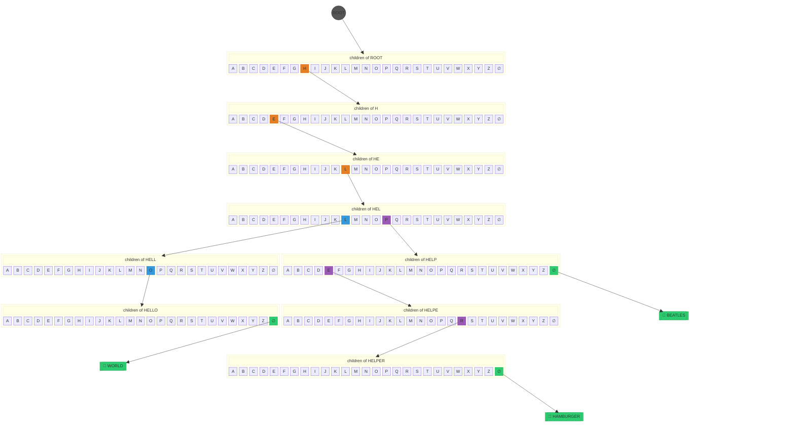

# KTRIE Concepts

This document describes the data structures, algorithms, and shared design concepts underlying both the KNTRIE (integer keys) and KSTRIE (string keys). Implementation-specific details are in their respective concept documents.

## Table of Contents

- [1 Data Structures and Algorithms](#1-data-structures-and-algorithms)
  - [1.1 TRIE](#11-trie)
  - [1.2 Binary Search](#12-binary-search)
  - [1.3 B-TREE](#13-b-tree)
  - [1.4 KTRIE](#14-ktrie)
- [2 KTRIE Shared Concepts](#2-ktrie-shared-concepts)
  - [2.1 Sentinel](#21-sentinel)
  - [2.2 Bitmaps](#22-bitmaps)
  - [2.3 Value Storage](#23-value-storage)
- [3 Comparisons with Other Structures](#3-comparisons-with-other-structures)
  - [3.1 HAT-trie](#31-hat-trie)
  - [3.2 ART (Adaptive Radix Tree)](#32-art-adaptive-radix-tree)
  - [3.3 Sorted Flat Array](#33-sorted-flat-array)
  - [3.4 absl::flat_hash_map](#34-abslflat_hash_map)
  - [3.5 Positioning](#35-positioning)

## 1 Data Structures and Algorithms

### 1.1 TRIE

A TRIE (from "retrieval") is a tree structure where each node represents a portion of a key rather than the whole key. In a string TRIE, each level might branch on one character. In a numeric TRIE, each level branches on some chunk of bits. The path from root to leaf spells out the complete key.

This gives TRIEs a fundamental property that distinguishes them from comparison-based trees: lookup cost depends on the key's length, not the number of entries. A TRIE with 100 entries and a TRIE with 100 million entries traverse the same number of levels for the same key.

A TRIE with elements **HELLO**/WORLD, **HELP**/BEATLES, and **HELPER**/HAMBURGER:



A digital trie is a trie whose key is bitwise, for 8 bits each trie would have 256 nodes. Unlike a alpabet based trie, all have the same depth, with leaves at the bottom.

A digital trie with elements **0x00000000**/NULL, **0x00000004**/FOUR, **0x000401BC**/POTITUS, **0xFEEDFACE**/HAMBURGER:

```mermaid
block
  columns 5

 %% ── Level 0: root pointer ──────────────────────────────────
  space
  space
  ROOT(("ROOT"))
  space
  space

%% ── Level 0: root ───────────────────────────────────────────
  space
  space
  block:L0
    columns 7
    space
    block:l0_title("byte 0 — 256 slots"):5
      space
    end
    space
    l0_00["00"] l0_01["01"] l0_02["02"] l0_g0["···"] l0_FD["FD"] l0_FE["FE"] l0_FF["FF"]
  end
  space
  space

%% ── Level 1: two children ───────────────────────────────────
    space
    
    block:L1_00
      columns 7
      space
      block:l1a_title("byte 1 — via 00"):5
        space
      end
      space
      l1a_00["00"] l1a_01["01"] l1a_02["02"] l1a_03["03"] l1a_04["04"] l1a_g0["···"] l1a_FF["FF"]
    end

    space

    block:L1_FE
      columns 7
      space
      block:l1b_title("byte 1 — via FE"):5
        space
      end
      space
      l1b_00["00"] l1b_g0["···"] l1b_EC["EC"] l1b_ED["ED"] l1b_EE["EE"] l1b_g1["···"] l1b_FF["FF"]
    end

    space

%% ── Level 2: three children ─────────────────────────────────

    block:L2_00_00
      columns 5
      space
      block:l2a_title("byte 2 — via 00·00"):3
        space
      end
      space
      l2a_00["00"] l2a_01["01"] l2a_02["02"] l2a_g0["···"] l2a_FF["FF"]
    end

    space

    block:L2_00_04
      columns 5
      space
      block:l2b_title("byte 2 — via 00·04"):3
        space
      end
      space
      l2b_00["00"] l2b_01["01"] l2b_02["02"] l2b_g0["···"] l2b_FF["FF"]
    end

    space

    block:L2_FE_ED
      columns 7
      space
      block:l2c_title("byte 2 — via FE·ED"):5
        space
      end
      space
      l2c_00["00"] l2c_g0["···"] l2c_F9["F9"] l2c_FA["FA"] l2c_FB["FB"] l2c_g1["···"] l2c_FF["FF"]
    end

%% ── Level 3: three leaves ───────────────────────────────────

    block:L3_00_00_00
      columns 7
      space
      block:l3a_title("byte 3 — via 00·00·00"):5
        space
      end
      space
      l3a_00["00"] l3a_01["01"] l3a_02["02"] l3a_03["03"] l3a_04["04"] l3a_g0["···"] l3a_FF["FF"]
    end

    block:L3_00_04_01
      columns 7
      space
      block:l3b_title("byte 3 — via 00·04·01"):5
        space
      end
      space
      l3b_00["00"] l3b_g0["···"] l3b_BB["BB"] l3b_BC["BC"] l3b_BD["BD"] l3b_g1["···"] l3b_FF["FF"]
    end

    space

    block:L3_FE_ED_FA
      columns 7
      space
      block:l3c_title("byte 3 — via FE·ED·FA"):5
        space
      end
      space
      l3c_00["00"] l3c_g0["···"] l3c_CD["CD"] l3c_CE["CE"] l3c_CF["CF"] l3c_g1["···"] l3c_FF["FF"]
    end

    space

%% ── Values ──────────────────────────────────────────────────
    val0[["0x00000000 → NULL"]]
    val1[["0x00000004 → FOUR"]]
    val2[["0x000401BC → POTITUS"]]
    space
    val3[["0xFEEDFACE → HAMBURGER"]]


%% ── Edges ───────────────────────────────────────────────────
  ROOT --> l0_title
  l0_00 --> l1a_title
  l0_FE --> l1b_title
  l1a_00 --> l2a_title
  l1a_04 --> l2b_title
  l1b_ED --> l2c_title
  l2a_00 --> l3a_title
  l2b_01 --> l3b_title
  l2c_FA --> l3c_title
  l3a_00 --> val0
  l3a_04 --> val1
  l3b_BC --> val2
  l3c_CE --> val3

%% ── Styles ──────────────────────────────────────────────────

%% Used slots — orange
  style l0_00 fill:#e67e22,color:#fff,stroke:#d35400
  style l0_FE fill:#e67e22,color:#fff,stroke:#d35400
  style l1a_00 fill:#e67e22,color:#fff,stroke:#d35400
  style l1a_04 fill:#e67e22,color:#fff,stroke:#d35400
  style l1b_ED fill:#e67e22,color:#fff,stroke:#d35400
  style l2a_00 fill:#e67e22,color:#fff,stroke:#d35400
  style l2b_01 fill:#e67e22,color:#fff,stroke:#d35400
  style l2c_FA fill:#e67e22,color:#fff,stroke:#d35400
  style l3a_00 fill:#e67e22,color:#fff,stroke:#d35400
  style l3a_04 fill:#e67e22,color:#fff,stroke:#d35400
  style l3b_BC fill:#e67e22,color:#fff,stroke:#d35400
  style l3c_CE fill:#e67e22,color:#fff,stroke:#d35400

%% Empty slots — grey
  style l0_01 fill:#ccc,color:#666,stroke:#aaa
  style l0_02 fill:#ccc,color:#666,stroke:#aaa
  style l0_FD fill:#ccc,color:#666,stroke:#aaa
  style l0_FF fill:#ccc,color:#666,stroke:#aaa
  style l1a_01 fill:#ccc,color:#666,stroke:#aaa
  style l1a_02 fill:#ccc,color:#666,stroke:#aaa
  style l1a_03 fill:#ccc,color:#666,stroke:#aaa
  style l1a_FF fill:#ccc,color:#666,stroke:#aaa
  style l1b_00 fill:#ccc,color:#666,stroke:#aaa
  style l1b_EC fill:#ccc,color:#666,stroke:#aaa
  style l1b_EE fill:#ccc,color:#666,stroke:#aaa
  style l1b_FF fill:#ccc,color:#666,stroke:#aaa
  style l2a_01 fill:#ccc,color:#666,stroke:#aaa
  style l2a_02 fill:#ccc,color:#666,stroke:#aaa
  style l2a_FF fill:#ccc,color:#666,stroke:#aaa
  style l2b_00 fill:#ccc,color:#666,stroke:#aaa
  style l2b_02 fill:#ccc,color:#666,stroke:#aaa
  style l2b_FF fill:#ccc,color:#666,stroke:#aaa
  style l2c_00 fill:#ccc,color:#666,stroke:#aaa
  style l2c_F9 fill:#ccc,color:#666,stroke:#aaa
  style l2c_FB fill:#ccc,color:#666,stroke:#aaa
  style l2c_FF fill:#ccc,color:#666,stroke:#aaa
  style l3a_01 fill:#ccc,color:#666,stroke:#aaa
  style l3a_02 fill:#ccc,color:#666,stroke:#aaa
  style l3a_03 fill:#ccc,color:#666,stroke:#aaa
  style l3a_FF fill:#ccc,color:#666,stroke:#aaa
  style l3b_00 fill:#ccc,color:#666,stroke:#aaa
  style l3b_BB fill:#ccc,color:#666,stroke:#aaa
  style l3b_BD fill:#ccc,color:#666,stroke:#aaa
  style l3b_FF fill:#ccc,color:#666,stroke:#aaa
  style l3c_00 fill:#ccc,color:#666,stroke:#aaa
  style l3c_CD fill:#ccc,color:#666,stroke:#aaa
  style l3c_CF fill:#ccc,color:#666,stroke:#aaa
  style l3c_FF fill:#ccc,color:#666,stroke:#aaa

%% Gaps — dotted
  style l0_g0 fill:none,color:#999,stroke:none
  style l1a_g0 fill:none,color:#999,stroke:none
  style l1b_g0 fill:none,color:#999,stroke:none
  style l1b_g1 fill:none,color:#999,stroke:none
  style l2a_g0 fill:none,color:#999,stroke:none
  style l2b_g0 fill:none,color:#999,stroke:none
  style l2c_g0 fill:none,color:#999,stroke:none
  style l2c_g1 fill:none,color:#999,stroke:none
  style l3a_g0 fill:none,color:#999,stroke:none
  style l3b_g0 fill:none,color:#999,stroke:none
  style l3b_g1 fill:none,color:#999,stroke:none
  style l3c_g0 fill:none,color:#999,stroke:none
  style l3c_g1 fill:none,color:#999,stroke:none

%% Values — green
  style val0 fill:#2ecc71,color:#fff,stroke:#27ae60
  style val1 fill:#2ecc71,color:#fff,stroke:#27ae60
  style val2 fill:#2ecc71,color:#fff,stroke:#27ae60
  style val3 fill:#2ecc71,color:#fff,stroke:#27ae60

  style ROOT fill:#555,color:#fff,stroke:#333

```



The classic problems with TRIEs are well known. A naïve implementation that allocates a N-entry child array at every level wastes enormous memory. Most slots are empty, especially near the leaves. Sparsely-occupied levels are the norm. The structure also suffers from pointer chasing: each level requires following a pointer to the next node, and those nodes are scattered across the heap with no cache locality guarantees. For small key populations, the overhead of multiple levels can exceed the cost of a flat sorted search. And for variable-depth TRIEs, the bookkeeping to know what type of node you're looking at, how deep you are, and when you've reached a leaf adds complexity at every step.

### 1.2 Binary Search

Binary search finds a target in a sorted array by repeatedly halving the search space. Starting with the full array, each step compares the middle element against the target and discards the half that cannot contain it. After log₂(N) comparisons, the target is either found or proven absent.

The standard implementation uses conditional branches: `if (mid < target) low = mid + 1; else high = mid;`. On modern CPUs, these branches are data-dependent — the branch predictor cannot know which half will be chosen until the comparison completes. When the array is large enough that the access pattern is effectively random (the typical case for the middle levels of a search), mispredictions stall the pipeline for 10–15 cycles each.

**Branchless binary search.** The KTRIE uses a branchless variant that replaces the conditional branch with a conditional move (cmov):

```cpp
static const K* find_base(const K* base, unsigned count, K key) noexcept {
    do {
        count >>= 1;
        base += (base[count] <= key) ? count : 0;
    } while (count > 1);
    return base;
}
```

Each iteration halves `count` and conditionally advances `base`. The comparison `base[count] <= key` produces a boolean that the compiler emits as a cmov instruction: the CPU computes both possible values of `base` and selects one, with no branch prediction involved. This executes in ~2 cycles per iteration regardless of the data pattern.

The requirement is that `count` must be a power of 2.

A `find_base_first` variant uses strict `<` instead of `<=` to find the first occurrence of a key (lower bound), used by iterator operations and duplicate-aware insertion.

### 1.3 B-TREE

A B-tree is a self-balancing search tree designed for systems where large blocks of data are read at once (originally disk pages, but equally applicable to CPU cache lines). Unlike a binary tree where each node holds one key and has two children, a B-tree node holds many keys in a sorted array and fans out to many children. A B-tree of order M stores up to M-1 keys per node and has up to M children.

The fundamental insight is that when data is accessed in blocks (whether disk sectors or cache lines), it's better to pack many keys into each block and search within it than to follow pointers between small nodes. A B-tree node with 100 keys in a contiguous sorted array can be searched with binary search, touching 1-2 cache lines, while the same 100 keys in a binary tree require ~7 pointer-chasing hops across 7 random cache lines.

B-trees maintain balance through split and merge operations. When a node overflows (exceeds M-1 keys), it splits into two nodes and pushes the median key up to the parent. When a node underflows (drops below ⌈M/2⌉-1 keys), it merges with a sibling. This keeps the tree balanced with O(log_M N) depth, much shallower than a binary tree's O(log_2 N) because the logarithm base is the fan-out M rather than 2.

The B-tree's strengths (wide nodes, sorted arrays searched via binary search, cache-friendly access patterns, and shallow depth) are exactly what a naïve TRIE lacks. A TRIE has the advantage of key-length-dependent lookup (independent of N), but its nodes are typically small and pointer-heavy.

However, B-trees have their own weaknesses. Lookup cost is O(log_M N): it depends on the number of entries, not the key length. As N grows into the millions, even with a high branching factor M, the tree deepens and each level is a potential cache miss. B-trees also provide no key compression: every entry stores the complete key, even when adjacent entries share long common prefixes. In a dataset where a million keys share the same first 6 bytes, a B-tree stores those 6 bytes a million times. Finally, B-tree split and merge operations must maintain global balance invariants, which adds complexity and can cascade upward through the tree.

### 1.4 KTRIE

The KTRIE is a cross between a TRIE and a B-tree, designed for compact data and fast reads. It uses TRIE-style prefix routing to navigate to the right region of the key space, then stores the remaining suffixes in B-tree-style wide sorted leaves. This combination introduces three structural ideas that address the classic problems of both parent structures.

A key in the KTRIE is decomposed into three logical regions:

```
KEY = [PREFIX] [BRANCH ...] [SUFFIX]
```

**PREFIX** is a run of key bytes that all entries in a subtree share. Rather than creating a chain of single-child nodes to traverse this common prefix (as a naïve TRIE would), the KTRIE captures the entire shared prefix in a single node. This eliminates the wasted memory and latency of redundant intermediate levels. When a lookup reaches a prefix-captured node, it compares the full prefix in one step and either continues or exits immediately.

**BRANCH** nodes are the KTRIE's equivalent of TRIE nodes. They fan out to up to N children based on a fixed-width chunk of the key. A TRIE node that branches on one byte has up to 256 children. The KTRIE may use one or more BRANCH levels depending on key width and data distribution. Each BRANCH node routes the lookup one step closer to the leaf by consuming a fixed number of key bits. The key difference from a naïve TRIE is that BRANCH nodes only exist where the data actually fans out. PREFIX capture absorbs the levels where it doesn't.

**SUFFIX** is the remaining portion of the key after all BRANCH levels have been consumed. Rather than continuing to subdivide into deeper BRANCH nodes, the KTRIE collects entries with different suffixes into a **compact leaf**: a flat sorted array of suffix/value pairs stored in a single allocation. This is the B-tree inheritance: wide sorted leaves that trade further tree subdivision for cache-friendly sequential storage. It directly addresses two TRIE problems: it eliminates pointer chasing for the tail of the key, and it avoids the memory overhead of sparsely-populated BRANCH nodes near the leaves. A compact leaf holding 100 entries in a contiguous sorted array is far more cache-friendly and memory-efficient than 100 entries scattered across a tree of BRANCH nodes.

**How this improves on a generic TRIE:**

The naïve TRIE has a fixed structure: every level creates a node, every node fans out by the same width, and every key traverses every level. The KTRIE adapts its structure to the data:

- Where keys share a common prefix, PREFIX capture collapses the redundant levels into a single comparison. A subtree where 1000 keys share the same top 4 bytes uses one node instead of four.

- Where the key space is sparse at a given level, BRANCH nodes only allocate for children that actually exist rather than reserving the full fan-out width.

- Where a subtree is small enough, compact leaves absorb all remaining SUFFIXes into a flat array, avoiding further branching entirely. The threshold for "small enough" determines how deep the TRIE actually goes for a given dataset; small datasets may never create BRANCH nodes at all.

The result is a structure whose depth and memory usage adapt to the actual key distribution rather than being fixed by the key width. Dense, clustered key ranges are captured by PREFIX nodes and compact leaves. Sparse, spread-out ranges are handled by BRANCH nodes that only allocate for children that exist.

## 2 KTRIE Shared Concepts

### 2.1 Sentinel

The sentinel is a distinguished value that represents "not found" or "empty." It is not a real entry. When a branch node has no child for a given byte, the child slot holds the sentinel. When the container is empty, the root is the sentinel.

The sentinel appears in two roles:

- **Empty root.** When the container has no entries, the root equals the sentinel. All operations check this before descent.
- **Branch node miss target.** When a branch lookup misses, the result is the sentinel. The caller recognizes it and returns not-found without further traversal.

The concrete representation of the sentinel differs between KNTRIE and KSTRIE; see their respective concept documents.

### 2.2 Bitmaps

The `bitmap_256_t` is a 256-bit bitmap stored as 4 `uint64_t` words, used throughout the KTRIE for compact representation of sets over the 256 possible byte values. Each branch node uses a bitmap to record which of the 256 possible child byte values are present, compressing the 256-entry child array to only the children that exist.

**Presence check.** Bit `i` of the bitmap represents index `i`:

```
word_index = i >> 6       // which of the 4 u64s (i / 64)
bit_index  = i & 63       // which bit within that word (i % 64)
```

Checking: `words[word_index] & (1ULL << bit_index)`.

**Computing the dense array position.** Given that index `i` is present, its position in the packed array is the number of set bits *before* index `i`, the popcount of all bits below position `i`.

The shift-left trick isolates the relevant bits. For the word containing the target bit:

```cpp
uint64_t before = words[w] << (63 - b);
```

This moves the target bit to position 63 and shifts everything above it out. `std::popcount(before)` counts the set bits at positions ≤ `b` in the original word, including the target bit itself.

To get the full position across all 4 words, add the popcounts of all complete words below the target word, done branchlessly:

```cpp
int slot = std::popcount(before);
slot += std::popcount(words[0]) & -int(w > 0);
slot += std::popcount(words[1]) & -int(w > 1);
slot += std::popcount(words[2]) & -int(w > 2);
```

The `& -int(w > N)` trick: when true, `-int(true)` is `-1` (all-ones in two's complement), so the popcount passes through. When false, the popcount is masked to zero. No branches.

**Branchless miss fallback.** When a bitmap lookup misses (the target byte is not present), the popcount-based dispatch resolves to a known position that references a sentinel node. The sentinel always returns "not found," so no conditional branch is needed at the bitmap level. A miss and a hit follow the same code path; only the data differs.

### 2.3 Value Storage

Values are handled through a compile-time trait that selects one of three storage categories based on type properties. The selection is entirely `constexpr`. The compiler generates specialized code for each category with zero runtime dispatch overhead.

| Category | Condition | Storage | Explanation |
|----------|-----------|---------|-------------|
| A | trivially_copyable && sizeof ≤ 8 | inline in slot array | small trivial types stored directly |
| B | `std::is_same_v<VALUE, bool>` | packed bits in u64 words | one bit per entry |
| C | all remaining types | pointer to heap-allocated T | non-trivial or sizeof > 8 |

**Category A: Trivial inline.** Applies when `sizeof(VALUE) <= 8` and the type is trivially copyable. The value is stored directly in the value region of the node: no indirection, no heap allocation, no destructor call. Values are memcpy'd in and out. This covers the common cases (`int`, `uint64_t`, `float`, `double`, pointers, small structs) with excellent cache behavior.

**Category B: Packed bool.** Applies when `VALUE` is `bool`. Instead of storing one byte per boolean, values are packed into `uint64_t` words with one bit per entry. This reduces per-entry value storage to 1/64th of a byte. Load returns a pointer to a static `true` or `false` constant based on the bit value.

**Category C: Heap-allocated pointer.** Applies when `sizeof(VALUE) > 8` or the type is not trivially copyable. The value is allocated on the heap via the rebind allocator, constructed in place, and the 8-byte pointer is stored in the slot array. Since a pointer is trivially copyable, the compiler optimizes moves of pointer arrays to `memcpy`/`memmove` automatically. Destroy must deallocate the heap object on erase or node teardown.

**Insert / Erase / Destroy behavior by category:**

| Operation | A (inline) | B (packed bool) | C (heap pointer) |
|-----------|-----------|-----------------|------------------|
| Insert (store) | raw write / memcpy | bit set | alloc + placement-new |
| Erase (single) | nothing | bit clear | destroy + dealloc |
| Destroy node | nothing | nothing | destroy + dealloc all live slots |

All dispatch is `if constexpr`; dead branches are eliminated at compile time. The slot movement strategy is uniform: non-overlapping transfers (realloc, new node, split) use `std::copy` (optimized to `memcpy` for trivial types); overlapping transfers (in-place insert gap, erase compaction) use `std::move` / `std::move_backward` (optimized to `memmove`).

## 3 Comparisons with Other Structures

This section compares the KTRIE family against other indexed structures that serve similar use cases. The goal is honest positioning: where KTRIE wins, where it doesn't, and why.

### 3.1 HAT-trie

The HAT-trie (Askitis and Sinha, 2007) extends the burst trie (Heinz, Zobel, and Williams, 2002) with hash-based containers at the leaves. It uses trie routing at upper levels and hash containers at the leaves. When a leaf's hash container exceeds a threshold, it "bursts" into trie nodes. The C++ implementations (hat-trie by Tessil, cedar) are well-regarded for string-keyed workloads.

**Point lookup.** HAT-trie leaves use hash lookup — O(1) expected per leaf access. KSTRIE compact leaves use binary search on first bytes plus suffix comparison — O(log E) where E is entries per leaf. For the common case of small leaves (< 100 entries), the difference is negligible. For large leaves, HAT-trie has an edge.

**Ordered iteration.** HAT-trie hash containers are unordered. Iterating in sorted order requires sorting leaf contents on the fly or maintaining a separate sorted index. KSTRIE compact leaves are always sorted; iteration is a single in-order walk with no post-sort.

**Prefix queries.** HAT-trie supports prefix search by walking trie nodes to the prefix point, then collecting from hash containers below. But the collection step requires visiting every hash entry (no ordering guarantee within containers). KSTRIE's `prefix_walk` produces entries in sorted order, and `prefix_split` can detach entire subtrees in O(1) at bitmask boundaries — operations that have no HAT-trie equivalent.

**Memory.** HAT-trie hash containers store full suffix keys per entry. KSTRIE's keysuffix sharing stores shared tail bytes once per chain, reducing suffix storage for keys with common structure (URLs, file paths, hierarchical identifiers). For random strings with no shared structure, the two are comparable.

**Write performance.** HAT-trie's hash containers have amortized O(1) insert. KSTRIE's sorted compact leaves require shifting entries on insert — O(E) per leaf insert. For write-heavy workloads with large leaves, HAT-trie wins. The KSTRIE is optimized for read-heavy workloads where the compact sorted layout pays back on every subsequent lookup and iteration.

### 3.2 ART (Adaptive Radix Tree)

ART uses four node sizes (Node4, Node16, Node48, Node256) that adapt to the fan-out at each level. Each level consumes one byte. There is no leaf compression: a 10-byte key traverses at least 10 nodes. The C++ implementation (libart, adaptive_radix_tree) is well-known for high-performance in-memory indexing.

**Point lookup.** ART's dispatch at each level is simple: Node4 uses linear scan, Node16 uses SIMD comparison, Node48 uses a 256-byte index array, Node256 uses direct indexing. No binary search, no suffix comparison. For point lookups, ART is faster per-level than KSTRIE's compact leaf binary search. However, ART traverses more levels because it has no leaf compression — every byte of the key is a separate level.

**Memory.** ART stores no key suffixes in leaves; the path through the trie reconstructs the key. But ART creates a node for every divergent byte. For keys with long shared prefixes, ART uses path compression (similar to KTRIE skip prefixes) but still creates one node per divergent byte after the shared prefix. KSTRIE's compact leaves absorb all remaining suffixes into one allocation with keysuffix sharing. For URL-like keys where many entries share long prefixes and diverge in the last few bytes, KSTRIE uses significantly less memory.

**Prefix queries.** ART supports prefix search by walking to the prefix node and collecting below. The traversal is natural (trie walk). KSTRIE adds node-level operations on top: `prefix_copy` via `clone_tree`, `prefix_split` via pointer steal, `prefix_erase` via subtree detach. These are structural operations that ART's node layout doesn't support without reconstruction.

**Concurrency.** ART has well-studied concurrent variants (ART-OLC, ART-ROWEX). The KTRIE family currently requires external synchronization for concurrent writes; concurrent reads are safe.

### 3.3 Sorted Flat Array

A sorted `std::vector<std::pair<Key, Value>>` with `std::lower_bound` for lookup. Simple, cache-friendly, and surprisingly competitive for small to medium datasets.

**Point lookup.** Binary search: O(log N) comparisons, each O(K) for string keys. For N < 1000, excellent cache behavior — the entire array fits in L2. For N > 100K, the O(K log N) cost and random access pattern make it slower than both trie structures and hash tables.

**Insert/erase.** O(N) element shift. Unacceptable for large N. Fine for build-once-read-many workloads where the data is sorted once and queried repeatedly.

**Memory.** Minimal overhead: just the key-value pairs plus vector bookkeeping. No pointers, no tree structure. For small trivial types, this is the densest possible representation. However, no key compression: every entry stores the full key.

**Prefix queries.** `lower_bound` on the prefix, then linear scan while the prefix matches. O(log N + M) where M is the match count. Same asymptotic as KSTRIE's iterator-pair `prefix()`, but KSTRIE's `prefix_walk` subtree traversal avoids the O(log N) initial binary search by descending directly to the subtree root.

**When to use.** The sorted flat array dominates for small N (< ~1000) where the array fits in cache and the simplicity of the data layout wins. It also dominates for build-once workloads where O(N) insert cost is paid once. For larger N with ongoing mutations, the O(N) insert/erase cost makes it impractical.

### 3.4 absl::flat_hash_map

Google's open-addressing hash table with SIMD-probed control bytes. The fastest general-purpose hash table widely available in C++. Uses Swiss Table layout: a flat array of slots plus a parallel array of 1-byte control tags, probed in 16-byte groups via SSE/AVX.

**Point lookup.** O(1) expected. The SIMD probe checks 16 control bytes in one instruction, achieving extremely low collision overhead. For pure point-lookup workloads, `flat_hash_map` is faster than any tree or trie structure.

**Memory.** Flat slot array with ~1 byte control overhead per slot. At the default 87.5% max load factor, ~14% of slots are empty. Keys are stored in full — no compression. For small keys (`int64_t`), the overhead is minimal. For string keys, each entry stores the complete string plus the `std::string` object overhead. A million URLs sharing a 20-byte prefix store that prefix a million times.

**No ordering.** No sorted iteration, no range queries, no prefix queries. These are fundamentally impossible with hash-based storage. If you need any ordered access, `flat_hash_map` cannot help.

**Rehashing.** When load factor exceeds the threshold, the entire table is reallocated and every entry is re-inserted. This causes latency spikes proportional to N.

**When to use.** When the workload is exclusively point lookups and point mutations (insert/erase/update by exact key), and no ordered access or prefix queries are ever needed. `flat_hash_map` wins this workload by a significant margin.

### 3.5 Positioning

The KTRIE family is not trying to beat hash tables on unordered point lookups. Its positioning is:

**vs. hash tables (flat_hash_map, unordered_map):** KTRIE provides ordered iteration, range queries, and prefix operations that hash tables cannot. For string keys, KTRIE compresses shared prefixes and suffixes — a million URL keys with common structure use a fraction of the memory. The trade-off is slower point lookups (O(K) trie descent vs O(1) hash probe).

**vs. ordered trees (std::map, B-tree):** KTRIE's O(K) lookup is independent of N, while tree lookup is O(K log N) for strings or O(log N) for integers. KTRIE's compact leaves provide better cache behavior than per-node tree allocations. Memory compression through prefix capture and suffix sharing further widens the gap.

**vs. trie variants (HAT-trie, ART):** KTRIE's compact leaves with keysuffix sharing provide better memory density for keys with shared structure. The B-tree-style sorted leaf layout gives ordered iteration without post-sorting. Node-level prefix operations (clone, steal, detach) are structural advantages unique to KTRIE.

**vs. sorted arrays:** KTRIE scales to large N with O(K) lookup and O(K + E) insert, where sorted arrays degrade to O(K log N) lookup and O(N) insert. For small N, the sorted array wins on simplicity and cache density.

The sweet spot: read-heavy workloads with ordered access requirements, prefix queries, and key populations that share common structure. The more your keys look like URLs, file paths, or hierarchical identifiers, the more KTRIE's compression pays off.

