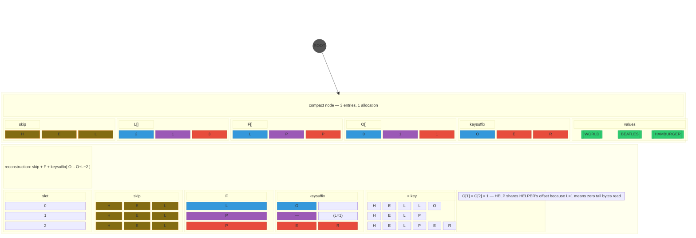
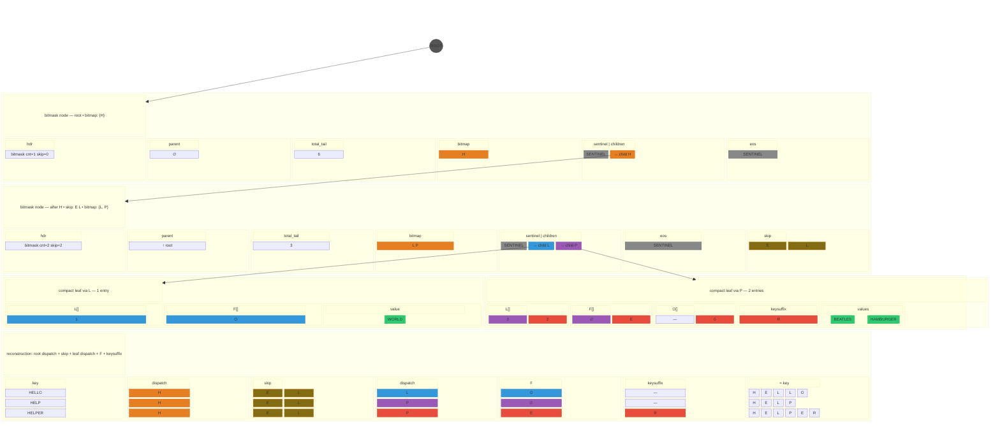

## TEST

```mermaid
block
  columns 1

  ROOT(("ROOT"))

  block:NODE
    columns 6

    block:title("compact node — 3 entries, 1 allocation"):6
      space
    end

    block:SK
      columns 3
      block:sk_lbl["skip"]:3
        space
      end
      sk0["H"] sk1["E"] sk2["L"]
    end

    block:LA
      columns 3
      block:l_lbl["L[]"]:3
        space
      end
      L0["2"] L1["1"] L2["3"]
    end

    block:FA
      columns 3
      block:f_lbl["F[]"]:3
        space
      end
      F0["L"] F1["P"] F2["P"]
    end

    block:OA
      columns 3
      block:o_lbl["O[]"]:3
        space
      end
      O0["0"] O1["1"] O2["1"]
    end

    block:KS
      columns 3
      block:ks_lbl["keysuffix"]:3
        space
      end
      ks0["O"] ks1["E"] ks2["R"]
    end

    block:VA
      columns 3
      block:v_lbl["values"]:3
        space
      end
      V0[["WORLD"]] V1[["BEATLES"]] V2[["HAMBURGER"]]
    end

  end

%% Reconstruction


  block:RECON
    columns 7

    block:rtitle("reconstruction: skip + F + keysuffix[ O .. O+L−2 ]"):7
      space
    end

    block:CS
      columns 1
      block:cs_lbl["slot"]:1
        space
      end
      cs0["0"] cs1["1"] cs2["2"]
    end

    block:RSKIP
      columns 3
      block:rsk_lbl["skip"]:3
        space
      end
      rs0_0["H"] rs0_1["E"] rs0_2["L"]
      rs1_0["H"] rs1_1["E"] rs1_2["L"]
      rs2_0["H"] rs2_1["E"] rs2_2["L"]
    end

    block:RF
      columns 1
      block:rf_lbl["F"]:1
        space
      end
      rf0["L"] rf1["P"] rf2["P"]
    end

    block:RKS
      columns 2
      block:rks_lbl["keysuffix"]:2
        space
      end
      rk0_0["O"] rk0_1[" "]
      rk1_0["—"] rk1_1["(L=1)"]
      rk2_0["E"] rk2_1["R"]
    end

    block:ROUT
      columns 6
      block:ro_lbl["= key"]:6
        space
      end
      ro00["H"] ro01["E"] ro02["L"] ro03["L"] ro04["O"] space
      ro10["H"] ro11["E"] ro12["L"] ro13["P"] space:2
      ro20["H"] ro21["E"] ro22["L"] ro23["P"] ro024["E"] ro25["R"]
    end


    %% Note
    block:NOTE:2
      columns 1
      note["O[1] = O[2] = 1 — HELP shares HELPER's offset because L=1 means zero tail bytes read"]
    end

  end
  
  ROOT --> title

  style ROOT fill:#555,color:#fff,stroke:#333

  style sk0 fill:#836c12,color:#fff,stroke:#e67e22
  style sk1 fill:#836c12,color:#fff,stroke:#e67e22
  style sk2 fill:#836c12,color:#fff,stroke:#e67e22

  style L0 fill:#3498db,color:#fff,stroke:#2980b9
  style L1 fill:#9b59b6,color:#fff,stroke:#8e44ad
  style L2 fill:#e74c3c,color:#fff,stroke:#c0392b

  style F0 fill:#3498db,color:#fff,stroke:#2980b9
  style F1 fill:#9b59b6,color:#fff,stroke:#8e44ad
  style F2 fill:#e74c3c,color:#fff,stroke:#c0392b

  style O0 fill:#3498db,color:#fff,stroke:#2980b9
  style O1 fill:#9b59b6,color:#fff,stroke:#8e44ad
  style O2 fill:#e74c3c,color:#fff,stroke:#c0392b

  style ks0 fill:#3498db,color:#fff,stroke:#2980b9
  style ks1 fill:#e74c3c,color:#fff,stroke:#c0392b
  style ks2 fill:#e74c3c,color:#fff,stroke:#c0392b

  style V0 fill:#2ecc71,color:#fff,stroke:#27ae60
  style V1 fill:#2ecc71,color:#fff,stroke:#27ae60
  style V2 fill:#2ecc71,color:#fff,stroke:#27ae60

  style rs0_0 fill:#836c12,color:#fff,stroke:#e67e22
  style rs0_1 fill:#836c12,color:#fff,stroke:#e67e22
  style rs0_2 fill:#836c12,color:#fff,stroke:#e67e22
  style rs1_0 fill:#836c12,color:#fff,stroke:#e67e22
  style rs1_1 fill:#836c12,color:#fff,stroke:#e67e22
  style rs1_2 fill:#836c12,color:#fff,stroke:#e67e22
  style rs2_0 fill:#836c12,color:#fff,stroke:#e67e22
  style rs2_1 fill:#836c12,color:#fff,stroke:#e67e22
  style rs2_2 fill:#836c12,color:#fff,stroke:#e67e22

  style rf0 fill:#3498db,color:#fff,stroke:#2980b9
  style rf1 fill:#9b59b6,color:#fff,stroke:#8e44ad
  style rf2 fill:#e74c3c,color:#fff,stroke:#c0392b

  style rk0_0 fill:#3498db,color:#fff,stroke:#2980b9
  style rk1_0 fill:#9b59b6,color:#fff,stroke:#8e44ad
  style rk2_0 fill:#e74c3c,color:#fff,stroke:#c0392b
  style rk2_1 fill:#e74c3c,color:#fff,stroke:#c0392b

  %% style ro0 fill:#2ecc71,color:#fff,stroke:#27ae60
  %% style ro1 fill:#2ecc71,color:#fff,stroke:#27ae60
  %% style ro2 fill:#2ecc71,color:#fff,stroke:#27ae60

```

```mermaid
block
  columns 1

  ROOT(("ROOT"))

%% ── Bitmask: root ────────────────────────────────────────────
  block:BM0
    columns 6

    block:bm0_title("bitmask node — root • bitmap: {H}"):6
      space
    end

    block:BM0_HDR
      columns 1
      block:bm0h_lbl["hdr"]:1
        space
      end
      bm0_hdr["bitmask cnt=1 skip=0"]
    end

    block:BM0_PAR
      columns 1
      block:bm0p_lbl["parent"]:1
        space
      end
      bm0_par["∅"]
    end

    block:BM0_TT
      columns 1
      block:bm0tt_lbl["total_tail"]:1
        space
      end
      bm0_tt["6"]
    end

    block:BM0_BMP
      columns 1
      block:bm0bm_lbl["bitmap"]:1
        space
      end
      bm0_bmp["H"]
    end

    block:BM0_SLOTS
      columns 2
      block:bm0sl_lbl["sentinel | children"]:2
        space
      end
      bm0_sent["SENTINEL"] bm0_c0["→ child H"]
    end

    block:BM0_EOS
      columns 1
      block:bm0e_lbl["eos"]:1
        space
      end
      bm0_eos["SENTINEL"]
    end

  end

%% ── Bitmask: after H, skip=EL ────────────────────────────────
  block:BM1
    columns 7

    block:bm1_title("bitmask node — after H • skip: E L • bitmap: {L, P}"):7
      space
    end

    block:BM1_HDR
      columns 1
      block:bm1h_lbl["hdr"]:1
        space
      end
      bm1_hdr["bitmask cnt=2 skip=2"]
    end

    block:BM1_PAR
      columns 1
      block:bm1p_lbl["parent"]:1
        space
      end
      bm1_par["↑ root"]
    end

    block:BM1_TT
      columns 1
      block:bm1tt_lbl["total_tail"]:1
        space
      end
      bm1_tt["3"]
    end

    block:BM1_BMP
      columns 1
      block:bm1bm_lbl["bitmap"]:1
        space
      end
      bm1_bmp["L P"]
    end

    block:BM1_SLOTS
      columns 3
      block:bm1sl_lbl["sentinel | children"]:3
        space
      end
      bm1_sent["SENTINEL"] bm1_cL["→ child L"] bm1_cP["→ child P"]
    end

    block:BM1_EOS
      columns 1
      block:bm1e_lbl["eos"]:1
        space
      end
      bm1_eos["SENTINEL"]
    end

    block:BM1_SKIP
      columns 2
      block:bm1sk_lbl["skip"]:2
        space
      end
      bm1_sk0["E"] bm1_sk1["L"]
    end

  end

%% ── Compact leaves side by side ──────────────────────────────
  block:LEAVES
    columns 2

%% Compact via L: one entry
    block:CK_L
      columns 3
      block:ckl_title("compact leaf via L — 1 entry"):3
        space
      end

      block:CKL_L
        columns 1
        block:ckl_l_lbl["L[]"]:1
          space
        end
        ckl_L0["1"]
      end
      block:CKL_F
        columns 1
        block:ckl_f_lbl["F[]"]:1
          space
        end
        ckl_F0["O"]
      end
      block:CKL_V
        columns 1
        block:ckl_v_lbl["value"]:1
          space
        end
        ckl_V0[["WORLD"]]
      end

    end

%% Compact via P: two entries
    block:CK_P
      columns 6
      block:ckp_title("compact leaf via P — 2 entries"):6
        space
      end

      block:CKP_L
        columns 2
        block:ckp_l_lbl["L[]"]:2
          space
        end
        ckp_L0["0"] ckp_L1["2"]
      end
      block:CKP_F
        columns 2
        block:ckp_f_lbl["F[]"]:2
          space
        end
        ckp_F0["∅"] ckp_F1["E"]
      end
      block:CKP_O
        columns 2
        block:ckp_o_lbl["O[]"]:2
          space
        end
        ckp_O0["—"] ckp_O1["0"]
      end
      block:CKP_KS
        columns 1
        block:ckp_ks_lbl["keysuffix"]:1
          space
        end
        ckp_ks0["R"]
      end
      block:CKP_V
        columns 2
        block:ckp_v_lbl["values"]:2
          space
        end
        ckp_V0[["BEATLES"]] ckp_V1[["HAMBURGER"]]
      end
      space

    end

  end

%% ── Reconstruction ───────────────────────────────────────────
  block:RECON
    columns 7

    block:rtitle("reconstruction: root dispatch + skip + leaf dispatch + F + keysuffix"):7
      space
    end

    block:CS
      columns 1
      block:cs_lbl["key"]:1
        space
      end
      cs0["HELLO"] cs1["HELP"] cs2["HELPER"]
    end

    block:RD
      columns 1
      block:rd_lbl["dispatch"]:1
        space
      end
      rd0["H"] rd1["H"] rd2["H"]
    end

    block:RSKIP
      columns 2
      block:rsk_lbl["skip"]:2
        space
      end
      rs0_0["E"] rs0_1["L"]
      rs1_0["E"] rs1_1["L"]
      rs2_0["E"] rs2_1["L"]
    end

    block:RLD
      columns 1
      block:rld_lbl["dispatch"]:1
        space
      end
      rld0["L"] rld1["P"] rld2["P"]
    end

    block:RLF
      columns 1
      block:rlf_lbl["F"]:1
        space
      end
      rlf0["O"] rlf1["∅"] rlf2["E"]
    end

    block:RLKS
      columns 1
      block:rlks_lbl["keysuffix"]:1
        space
      end
      rlks0["—"] rlks1["—"] rlks2["R"]
    end

    block:ROUT
      columns 6
      block:ro_lbl["= key"]:6
        space
      end
      ro00["H"] ro01["E"] ro02["L"] ro03["L"] ro04["O"] space
      ro10["H"] ro11["E"] ro12["L"] ro13["P"] space:2
      ro20["H"] ro21["E"] ro22["L"] ro23["P"] ro24["E"] ro25["R"]
    end

  end

  ROOT --> bm0_title
  bm0_c0 --> bm1_title
  bm1_cL --> ckl_title
  bm1_cP --> ckp_title

  style ROOT fill:#555,color:#fff,stroke:#333

  style bm0_bmp fill:#e67e22,color:#fff,stroke:#d35400
  style bm0_c0 fill:#e67e22,color:#fff,stroke:#d35400
  style bm0_sent fill:#888,color:#fff,stroke:#666
  style bm0_eos fill:#888,color:#fff,stroke:#666

  style bm1_bmp fill:#e67e22,color:#fff,stroke:#d35400
  style bm1_cL fill:#3498db,color:#fff,stroke:#2980b9
  style bm1_cP fill:#9b59b6,color:#fff,stroke:#8e44ad
  style bm1_sent fill:#888,color:#fff,stroke:#666
  style bm1_eos fill:#888,color:#fff,stroke:#666
  style bm1_sk0 fill:#836c12,color:#fff,stroke:#e67e22
  style bm1_sk1 fill:#836c12,color:#fff,stroke:#e67e22

  style ckl_L0 fill:#3498db,color:#fff,stroke:#2980b9
  style ckl_F0 fill:#3498db,color:#fff,stroke:#2980b9
  style ckl_V0 fill:#2ecc71,color:#fff,stroke:#27ae60

  style ckp_L0 fill:#9b59b6,color:#fff,stroke:#8e44ad
  style ckp_L1 fill:#e74c3c,color:#fff,stroke:#c0392b
  style ckp_F0 fill:#9b59b6,color:#fff,stroke:#8e44ad
  style ckp_F1 fill:#e74c3c,color:#fff,stroke:#c0392b
  style ckp_O1 fill:#e74c3c,color:#fff,stroke:#c0392b
  style ckp_ks0 fill:#e74c3c,color:#fff,stroke:#c0392b
  style ckp_V0 fill:#2ecc71,color:#fff,stroke:#27ae60
  style ckp_V1 fill:#2ecc71,color:#fff,stroke:#27ae60

  style rd0 fill:#e67e22,color:#fff,stroke:#d35400
  style rd1 fill:#e67e22,color:#fff,stroke:#d35400
  style rd2 fill:#e67e22,color:#fff,stroke:#d35400

  style rs0_0 fill:#836c12,color:#fff,stroke:#e67e22
  style rs0_1 fill:#836c12,color:#fff,stroke:#e67e22
  style rs1_0 fill:#836c12,color:#fff,stroke:#e67e22
  style rs1_1 fill:#836c12,color:#fff,stroke:#e67e22
  style rs2_0 fill:#836c12,color:#fff,stroke:#e67e22
  style rs2_1 fill:#836c12,color:#fff,stroke:#e67e22

  style rld0 fill:#3498db,color:#fff,stroke:#2980b9
  style rld1 fill:#9b59b6,color:#fff,stroke:#8e44ad
  style rld2 fill:#e74c3c,color:#fff,stroke:#c0392b

  style rlf0 fill:#3498db,color:#fff,stroke:#2980b9
  style rlf1 fill:#9b59b6,color:#fff,stroke:#8e44ad
  style rlf2 fill:#e74c3c,color:#fff,stroke:#c0392b

  style rlks2 fill:#e74c3c,color:#fff,stroke:#c0392b
```
