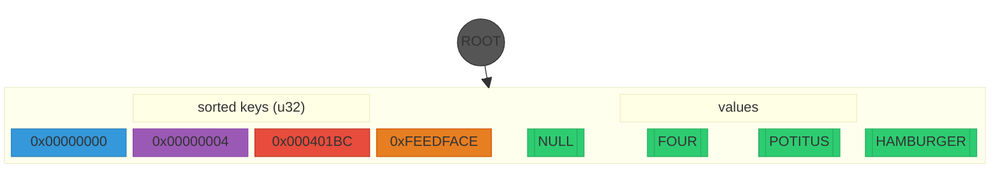

## KNTRIE Compact Node

Four u32 keys stored in a single compact node. Root skip = 0 (first byte diverges: 0x00 vs 0xFE). Suffix type is u32 (full key width, depth 0). Sorted array of suffix/value pairs.

**Blue/purple/red/orange**: sorted u32 suffix keys — one color per entry.
**Green**: values.

No skip prefix (byte 0 diverges: 0x00 vs 0xFE). No branch nodes needed — 4 entries is well below COMPACT_MAX (4096). Lookup is a branchless binary search over the 4-element u32 array: `bit_width(3) = 2`, count2 = 2, diff = 2, one diff comparison + one loop iteration.
