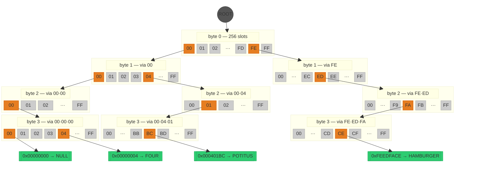

## TEST 2

```mermaid
block
  columns 5

 %% ── Level 0: root pointer ──────────────────────────────────
  space
  space
  ROOT(("ROOT"))
  space
  space

%% ── Level 0: root ───────────────────────────────────────────
  space
  space
  block:L0
    columns 7
    space
    block:l0_title("byte 0 — 256 slots"):5
      space
    end
    space
    l0_00["00"] l0_01["01"] l0_02["02"] l0_g0["···"] l0_FD["FD"] l0_FE["FE"] l0_FF["FF"]
  end
  space
  space

%% ── Level 1: two children ───────────────────────────────────
    space
    
    block:L1_00
      columns 7
      space
      block:l1a_title("byte 1 — via 00"):5
        space
      end
      space
      l1a_00["00"] l1a_01["01"] l1a_02["02"] l1a_03["03"] l1a_04["04"] l1a_g0["···"] l1a_FF["FF"]
    end

    space

    block:L1_FE
      columns 7
      space
      block:l1b_title("byte 1 — via FE"):5
        space
      end
      space
      l1b_00["00"] l1b_g0["···"] l1b_EC["EC"] l1b_ED["ED"] l1b_EE["EE"] l1b_g1["···"] l1b_FF["FF"]
    end

    space

%% ── Level 2: three children ─────────────────────────────────

    block:L2_00_00
      columns 5
      space
      block:l2a_title("byte 2 — via 00·00"):3
        space
      end
      space
      l2a_00["00"] l2a_01["01"] l2a_02["02"] l2a_g0["···"] l2a_FF["FF"]
    end

    space

    block:L2_00_04
      columns 5
      space
      block:l2b_title("byte 2 — via 00·04"):3
        space
      end
      space
      l2b_00["00"] l2b_01["01"] l2b_02["02"] l2b_g0["···"] l2b_FF["FF"]
    end

    space

    block:L2_FE_ED
      columns 7
      space
      block:l2c_title("byte 2 — via FE·ED"):5
        space
      end
      space
      l2c_00["00"] l2c_g0["···"] l2c_F9["F9"] l2c_FA["FA"] l2c_FB["FB"] l2c_g1["···"] l2c_FF["FF"]
    end

%% ── Level 3: three leaves ───────────────────────────────────

    block:L3_00_00_00
      columns 7
      space
      block:l3a_title("byte 3 — via 00·00·00"):5
        space
      end
      space
      l3a_00["00"] l3a_01["01"] l3a_02["02"] l3a_03["03"] l3a_04["04"] l3a_g0["···"] l3a_FF["FF"]
    end

    block:L3_00_04_01
      columns 7
      space
      block:l3b_title("byte 3 — via 00·04·01"):5
        space
      end
      space
      l3b_00["00"] l3b_g0["···"] l3b_BB["BB"] l3b_BC["BC"] l3b_BD["BD"] l3b_g1["···"] l3b_FF["FF"]
    end

    space

    block:L3_FE_ED_FA
      columns 7
      space
      block:l3c_title("byte 3 — via FE·ED·FA"):5
        space
      end
      space
      l3c_00["00"] l3c_g0["···"] l3c_CD["CD"] l3c_CE["CE"] l3c_CF["CF"] l3c_g1["···"] l3c_FF["FF"]
    end

    space

%% ── Values ──────────────────────────────────────────────────
    val0[["0x00000000 → NULL"]]
    val1[["0x00000004 → FOUR"]]
    val2[["0x000401BC → POTITUS"]]
    space
    val3[["0xFEEDFACE → HAMBURGER"]]


%% ── Edges ───────────────────────────────────────────────────
  ROOT --> l0_title
  l0_00 --> l1a_title
  l0_FE --> l1b_title
  l1a_00 --> l2a_title
  l1a_04 --> l2b_title
  l1b_ED --> l2c_title
  l2a_00 --> l3a_title
  l2b_01 --> l3b_title
  l2c_FA --> l3c_title
  l3a_00 --> val0
  l3a_04 --> val1
  l3b_BC --> val2
  l3c_CE --> val3

%% ── Styles ──────────────────────────────────────────────────

%% Used slots — orange
  style l0_00 fill:#e67e22,color:#fff,stroke:#d35400
  style l0_FE fill:#e67e22,color:#fff,stroke:#d35400
  style l1a_00 fill:#e67e22,color:#fff,stroke:#d35400
  style l1a_04 fill:#e67e22,color:#fff,stroke:#d35400
  style l1b_ED fill:#e67e22,color:#fff,stroke:#d35400
  style l2a_00 fill:#e67e22,color:#fff,stroke:#d35400
  style l2b_01 fill:#e67e22,color:#fff,stroke:#d35400
  style l2c_FA fill:#e67e22,color:#fff,stroke:#d35400
  style l3a_00 fill:#e67e22,color:#fff,stroke:#d35400
  style l3a_04 fill:#e67e22,color:#fff,stroke:#d35400
  style l3b_BC fill:#e67e22,color:#fff,stroke:#d35400
  style l3c_CE fill:#e67e22,color:#fff,stroke:#d35400

%% Empty slots — grey
  style l0_01 fill:#ccc,color:#666,stroke:#aaa
  style l0_02 fill:#ccc,color:#666,stroke:#aaa
  style l0_FD fill:#ccc,color:#666,stroke:#aaa
  style l0_FF fill:#ccc,color:#666,stroke:#aaa
  style l1a_01 fill:#ccc,color:#666,stroke:#aaa
  style l1a_02 fill:#ccc,color:#666,stroke:#aaa
  style l1a_03 fill:#ccc,color:#666,stroke:#aaa
  style l1a_FF fill:#ccc,color:#666,stroke:#aaa
  style l1b_00 fill:#ccc,color:#666,stroke:#aaa
  style l1b_EC fill:#ccc,color:#666,stroke:#aaa
  style l1b_EE fill:#ccc,color:#666,stroke:#aaa
  style l1b_FF fill:#ccc,color:#666,stroke:#aaa
  style l2a_01 fill:#ccc,color:#666,stroke:#aaa
  style l2a_02 fill:#ccc,color:#666,stroke:#aaa
  style l2a_FF fill:#ccc,color:#666,stroke:#aaa
  style l2b_00 fill:#ccc,color:#666,stroke:#aaa
  style l2b_02 fill:#ccc,color:#666,stroke:#aaa
  style l2b_FF fill:#ccc,color:#666,stroke:#aaa
  style l2c_00 fill:#ccc,color:#666,stroke:#aaa
  style l2c_F9 fill:#ccc,color:#666,stroke:#aaa
  style l2c_FB fill:#ccc,color:#666,stroke:#aaa
  style l2c_FF fill:#ccc,color:#666,stroke:#aaa
  style l3a_01 fill:#ccc,color:#666,stroke:#aaa
  style l3a_02 fill:#ccc,color:#666,stroke:#aaa
  style l3a_03 fill:#ccc,color:#666,stroke:#aaa
  style l3a_FF fill:#ccc,color:#666,stroke:#aaa
  style l3b_00 fill:#ccc,color:#666,stroke:#aaa
  style l3b_BB fill:#ccc,color:#666,stroke:#aaa
  style l3b_BD fill:#ccc,color:#666,stroke:#aaa
  style l3b_FF fill:#ccc,color:#666,stroke:#aaa
  style l3c_00 fill:#ccc,color:#666,stroke:#aaa
  style l3c_CD fill:#ccc,color:#666,stroke:#aaa
  style l3c_CF fill:#ccc,color:#666,stroke:#aaa
  style l3c_FF fill:#ccc,color:#666,stroke:#aaa

%% Gaps — dotted
  style l0_g0 fill:none,color:#999,stroke:none
  style l1a_g0 fill:none,color:#999,stroke:none
  style l1b_g0 fill:none,color:#999,stroke:none
  style l1b_g1 fill:none,color:#999,stroke:none
  style l2a_g0 fill:none,color:#999,stroke:none
  style l2b_g0 fill:none,color:#999,stroke:none
  style l2c_g0 fill:none,color:#999,stroke:none
  style l2c_g1 fill:none,color:#999,stroke:none
  style l3a_g0 fill:none,color:#999,stroke:none
  style l3b_g0 fill:none,color:#999,stroke:none
  style l3b_g1 fill:none,color:#999,stroke:none
  style l3c_g0 fill:none,color:#999,stroke:none
  style l3c_g1 fill:none,color:#999,stroke:none

%% Values — green
  style val0 fill:#2ecc71,color:#fff,stroke:#27ae60
  style val1 fill:#2ecc71,color:#fff,stroke:#27ae60
  style val2 fill:#2ecc71,color:#fff,stroke:#27ae60
  style val3 fill:#2ecc71,color:#fff,stroke:#27ae60

  style ROOT fill:#555,color:#fff,stroke:#333

```
