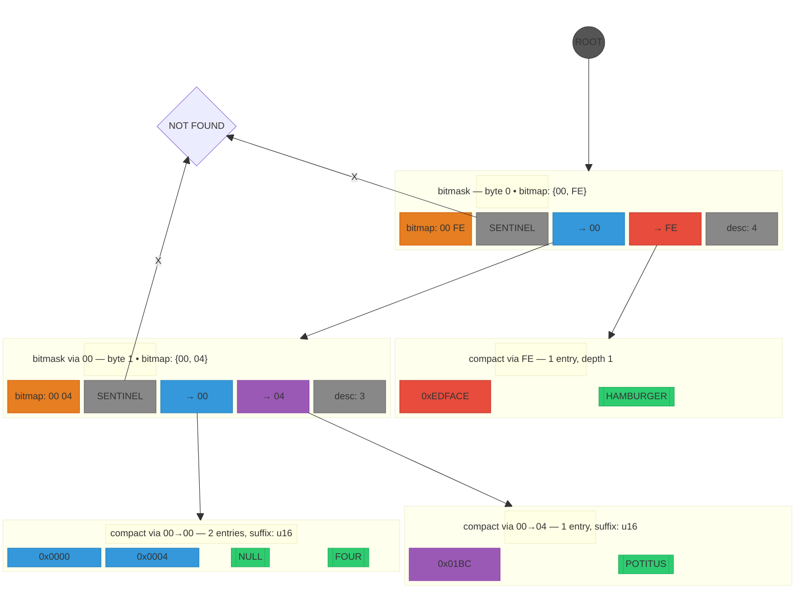

## KNTRIE Bitmask Nodes

Same four u32 keys with two levels of bitmask dispatch. Byte 0 splits {00, FE}. Byte 1 splits the 00-subtree into {00, 04}. Suffix type narrows from u32 → u16 at depth 2.

**Level 0**: root bitmask dispatches byte 0. Bitmap {00, FE} — 2 children out of 256 possible.
**Level 1**: 00-subtree bitmask dispatches byte 1. Bitmap {00, 04} — 2 children. FE-subtree is a single-entry compact node (no further branching needed).
**Level 2**: compact leaves with suffix narrowed to u16 (2 bytes consumed, 2 remaining). Sorted within each leaf.

Suffix narrowing: the root stores u32 suffixes, but after consuming 2 bytes of dispatch, the leaves store u16 — halving per-entry key storage. The same four entries that occupied 9 × 256 slots in the digital trie (Figure 2) now occupy 2 bitmask nodes + 3 compact nodes, each holding only the entries that belong there.
